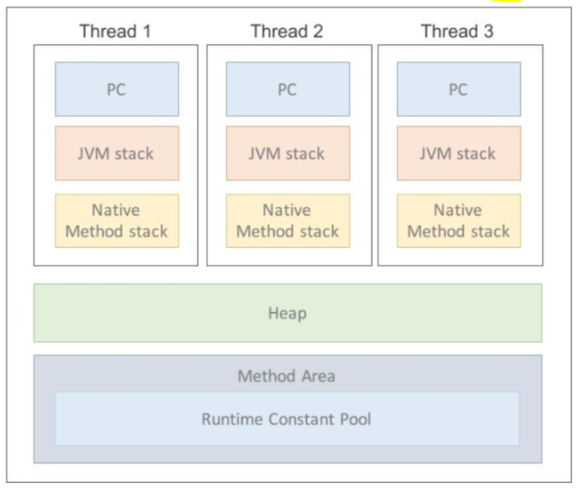

## 2주차 노트   

---

### 자바 컴파일러 작동 원리

- 자바 컴파일러란?

    자바 프로그램을 컴퓨터가 이해할 수 있는 기계어로 변환하는 프로그램으로, JDK를 설치하면 bin에 존재하는 javac.exe이다.
    자바 프로그래밍에서 중요한 역할을 담당하며, 자바 프로그래밍에서 코드의 안정성과 효율성을 높이는 데 필수적인 역할을 한다.
    자바의 장점 중 하나인 플랫폼 독립성을 제공하므로, 컴파일된 클래스 파일은 어느 운영체제에서든 실행 가능하다.

- 자바 컴파일 작동 순서
1. 개발자가 `자바 소스코드(.java)`를 작성한다.
2. 자바 컴파일러가 자바 소스파일을 컴파일한다.
   - 이 때 나오는 파일은 `자바 바이트 코드(.class)` 파일로 아직 컴퓨터가 읽을 수 없는 자바 가상 머신이 이해할 수 있는 코드이다. 바이트 코드의 각 명령어는 1바이트 크기의 [Opcode](#용어-모음)와 추가 피연산자로 이루어져 있다.
3. 컴파일된 바이트 코드를 `JVM`의 [클래스 로더(Class Loader)](#용어-모음)에게 전달
4. 클래스 로더는 [동적로딩(Dynamic Loading)](#용어-모음) 을 통해 필요한 클래스들을 로딩 및 링크하여 `런타임 데이터 영역`, 즉 JVM의 메모리에 올린다.
5. 실행엔진은 JVM 메모리에 올라온 바이트 코드들을 명령어 단위로 하나씩 가져와서 실행. 이 때, 실행 엔진은 두 가지 방식으로 변경한다. 
   1. `인터프리터`: 바이트 코드 명령어를 하나씩 읽어서 해석하고 실행한다. 하나하나의 실행은 빠르나, 전체적인 실행 속도가 느리다는 단점을 가짐.
   2. `JIT 컴파일러(Just-In-Time Compiler)`: 바이트 코드 전체를 컴파일하여 바이너리 코드로 변경하고, 이후에는 해당 메소드를 더이상 인터프리팅 하지 않고, 바이너리 코드로 직접 실행하는 방식. 전체적인 실행속도는 인터프리팅 방식보다 빠르다.

----
### 클래스 로더 세부 동작
1. 로드 : 클래스 파일을 가져와서 JVM의 메모리에 로드한다.
2. 검증 : 자바 언어 명세 및 JVM 명세에 명시된 대로 구성되어 있는지 검사한다.
3. 준비 : 클래스가 필요로 하는 메모리를 할당(필드, 메소드, 인터페이스 등)
4. 분석 : 클래스의 상수 풀 내 모든 심볼릭 레퍼런스를 다이렉트 레퍼런스로 변경한다.
5. 초기화 : 클래스 변수들은 적절한 값으로 초기화한다.(static 필드)

---
### JVM 이란?
      Java Virtual Machine의 줄임말로 OS에 종속받지 않고 CPU가 Java를 인식, 실행할 수 있게 해주는 가상 컴퓨터 개념이다.
- ##### JVM 구성 요소
   - 클래스 로더
   - 실행 엔진
     - 인터프리터
     - JIT 컴파일러
     - 가비지 콜렉터
   - 런타임 데이터 영역
  
- ##### 가비지 콜렉터
      유효하지 않은 메모리를 c언어에서 free()를 통해 직접 메모리를 해제 해 주어야 하는 반면, Java나 Kotlin에서는 JVM의 가비지 콜렉터가
      알아서 메모리를 정리해준다.
    - 자바의 런타임 데이터 영역 중 힙 메모리에는 객체의 생존 기간에 따라 Young, Old 영역으로 나뉜다. (Perm영역은 Java8부터 삭제되었다.)
        - `Young 영역`
          - 새롭게 생성된 객체가 할당 되는 영역
          - 대부분의 객체가 금방 Unreachable 상태가 되기 때문에, 많은 객체가 Young 영역에 있다가 사라진다.
          - Young 영역에 대한 가비지 컬렉션을 Minor GC라고 부른다.
        - `Old 영역`
          - Young 영역에서 Reachable 상태를 유지하여 살아남은 객체가 복사되는 영역
          - Young 영역보다 크게 할당되며, 영역의 크기가 큰 만큼 가비지는 적게 발생한다.
            - 크기가 큰 이유? >> Young 영역 객체들보다 비교적 큰 객체들이 있기 때문에 큰 공간을 필요로 한다.
          
          - Old 영역에 대한 가비지 컬렉션을 Major GC 또는 Full GC 라고 부른다.
- ##### 런타임 데이터 영역

- PC register
  - [Thread](#용어-모음)가 시작될 때 생성되며 생성될 때마다 생성되는 공간으로, 스레드마다 하나씩 존재한다.
    `Thread`가 어떤 부분을 어떤 명령으로 실행해야할 지에 대한 기록을 하는 부분으로 현재 수행 중인 JVM 명령의 주소를 갖는다.

- JVM 스택 영역

       프로그램 실행 과정에서 임시로 할당되었다가 메소드를 빠져나가면 바로 소멸되는 특성의 데이터를 저장하기 위한 영역.
  - 각종 형태의 변수나 임시 데이터, 스레드나 메소드의 정보를 저장한다.
  - 메소드 호출 시마다 각각의 스택 프레임(그 메서드만을 위한 공간)이 생성된다. 메서드 수행이 끝나면 프레임 별로 삭제를 한다.
  - 메소드 안에서 사용되는 값들을 저장한다. 또 호출된 메소드의 매개변수, 지역변수, 리턴 값 및 연산 시 일어나는 값들을 임시로 저장한다.

- Native method stack
        
        자바 프로그램이 컴파일되어 생성되는 바이트 코드가 아닌 실제 실행할 수 있는 기계어로 작성된 프로그램을 실행시키는 영역.
    - JAVA가 아닌 다른 언어로 작성된 코드를 위한 공간.
    - Java Native Interface를 통해 바이트 코드로 전환하여 저장하게 된다.
    - 일반 프로그램처럼 커널이 스택을 잡아 독자적으로 프로그램을 실행시키는 영역

- Method Area (= Class Area, Static Area)
        
        클래스 정보를 처음 메모리 공간에 올릴 때 초기화되는 대상을 저장하기 위한 공간

- Runtime Constant Pool
        
        스태틱 영역에 존재하는 별도의 관리 영역
  - 상수 자료형을 저장하여 참조하고 중복을 막는 역할 수행

- Heap 영역
        
      객체를 저장하는 가상메모리 공간. new 연산자로 생성되는 객체와 배열을 저장한다. 
      Class Area(Static Area)에 올라온 클래스들만 객체로 생성할 수 있다.
---

### JDK와 JRE의 차이?
- `JDK` : Java Development Kit(자바 개발 키트)

        Java를 사용하기 위해 필요한 모든 기능을 갖춘 Java용 SDK
        
    - JDK는 JRE를 포함하고 있다.
    - JRE에 있는 모든 것 뿐만 아니라 컴파일러(javac) 와 jdb, javadoc과 같은 도구도 있다.
    - 즉, JDK는 프로그램을 생성, 실행, 컴파일 할 수 있다.
    - [SDK](#용어-모음)
  

- `JRE` : Java Runtime Environment(자바 런타임 환경)

        JVM + 자바 클래스 라이브러리 등으로 구성 되어 있다.
    - 컴파일 된 Java 프로그램을 실행하는 데 필요한 패키지이다.

### 용어 모음
`Opcode` : `Operation Code`의 줄임말로 기계어의 일부이며 수행할 명령어를 나타내는 부호이다. 주소를 나타내는 `operand`와 합쳐 `명령어` 라고 부른다.

`클래스 로더` : `.class` 바이트 코드를 읽어 들여 `class 객체`를 생성하는 역할을 담당한다. 즉, 클래스 로더는 클래스가 요청될 때 파일로부터 읽어 메모리로 로딩하는 역할을 하며 자바 가상 머신의 중요한 요소 중 하나다.

`동적 로딩` : 런타임 시 JVM이 동적으로 참조할 클래스 로딩. JVM이 클래스에 대한 정보를 갖고 있지 않으므로, 자바는 동적으로 클래스를 읽어온다. 로드타임 동적 로딩과 런타임 동적 로딩이 있다.
- 로드타임 동적 로딩 : 하나의 클래스를 로딩하는 과정에서 이와 관련된 클래스들을 한꺼번에 로드 하는것.
- 런타임 동적 로딩 : 객체를 참조하는 순간에 동적으로 로드 하는 것.  

`Thread` : 스레드(thread)란 프로세스(process) 내에서 실제로 작업을 수행하는 주체를 의미한다. 모든 프로세스에는 한 개 이상의 스레드가 존재하여 작업을 수행한다.
또한, 두 개 이상의 스레드를 가지는 프로세스를 멀티스레드 프로세스(multi-threaded process)라고 한다.

`SDK` : Software Development Kit(소프트웨어 개발 키트). 하드웨어 플랫폼, 운영체제 또는 프로그래밍 언어 제작사가 제공하는 툴이다.
        

[출처]

- https://velog.io/@woo00oo/%EC%9E%90%EB%B0%94-%EC%BB%B4%ED%8C%8C%EC%9D%BC-%EA%B3%BC%EC%A0%
- https://velog.io/@mincho920/Java%EC%9D%98-%EB%8F%99%EC%A0%81%EB%A1%9C%EB%94%A9
- https://kkang-joo.tistory.com/9
- https://doozi0316.tistory.com/entry/1%EC%A3%BC%EC%B0%A8-JVM%EC%9D%80-%EB%AC%B4%EC%97%87%EC%9D%B4%EB%A9%B0-%EC%9E%90%EB%B0%94-%EC%BD%94%EB%93%9C%EB%8A%94-%EC%96%B4%EB%96%BB%EA%B2%8C-%EC%8B%A4%ED%96%89%ED%95%98%EB%8A%94-%EA%B2%83%EC%9D%B8%EA%B0%80
- https://mangkyu.tistory.com/118