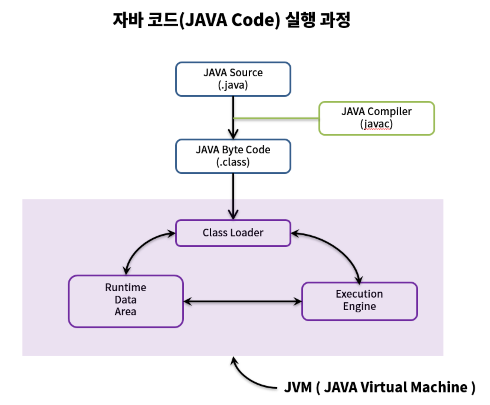

## 2주차 노트   

---

### 자바 컴파일러 작동 원리

- 자바 컴파일러란?

    자바 프로그램을 컴퓨터가 이해할 수 있는 기계어로 변환하는 프로그램이다.
    자바 프로그래밍에서 중요한 역할을 담당하며, 자바 프로그래밍에서 코드의 안정성과 효율성을 높이는 데 필수적인 역할을 한다.
    자바의 장점 중 하나인 플랫폼 독립성을 제공하므로, 컴파일된 클래스 파일은 어느 운영체제에서든 실행 가능하다.

- 자바 컴파일 작동 순서
1. 개발자가 `자바 소스코드(.java)`를 작성한다.
2. 자바 컴파일러가 자바 소스파일을 컴파일한다.
   - 이 때 나오는 파일은 `자바 바이트 코드(.class)` 파일로 아직 컴퓨터가 읽을 수 없는 자바 가상 머신이 이해할 수 있는 코드이다. 바이트 코드의 각 명령어는 1바이트 크기의 [Opcode](#용어-모음)와 추가 피연산자로 이루어져 있다.
3. 컴파일된 바이트 코드를 `JVM`의 [클래스 로더(Class Loader)](#클래스-로더-세부-동작)에게 전달
4. 클래스 로더는 [동적로딩(Dynamic Loading)](#용어-모음) 을 통해 필요한 클래스들을 로딩 및 링크하여 `런타임 데이터 영역`, 즉 JVM의 메모리에 올린다.
5. 실행엔진은 JVM 메모리에 올라온 바이트 코드들을 명령어 단위로 하나씩 가져와서 실행. 이 때, 실행 엔진은 두 가지 방식으로 변경한다. 
   1. `인터프리터`: 바이트 코드 명령어를 하나씩 읽어서 해석하고 실행한다. 하나하나의 실행은 빠르나, 전체적인 실행 속도가 느리다는 단점을 가짐.
   2. `JIT 컴파일러(Just-In-Time Compiler)`: 바이트 코드 전체를 컴파일하여 바이너리 코드로 변경하고, 이후에는 해당 메소드를 더이상 인터프리팅 하지 않고, 바이너리 코드로 직접 실행하는 방식. 전체적인 실행속도는 인터프리팅 방식보다 빠르다.

### 클래스 로더 세부 동작
1. 로드 : 클래스 파일을 가져와서 JVM의 메모리에 로드한다.
2. 검증 : 자바 언어 명세 및 JVM 명세에 명시된 대로 구성되어 있는지 검사한다.
3. 준비 : 클래스가 필요로 하는 메모리를 할당(필드, 메소드, 인터페이스 등)
4. 분석 : 클래스의 상수 풀 내 모든 심볼릭 레퍼런스를 다이렉트 레퍼런스로 변경한다.
5. 초기화 : 클래스 변수들은 적절한 값으로 초기화한다.(static 필드)

### 용어 모음
`Opcode` : `Operation Code`의 줄임말로 기계어의 일부이며 수행할 명령어를 나타내는 부호이다. 주소를 나타내는 `operand`와 합쳐 `명령어` 라고 부른다.

`클래스 로더` : `.class` 바이트 코드를 읽어 들여 `class 객체`를 생성하는 역할을 담당한다. 즉, 클래스 로더는 클래스가 요청될 때 파일로부터 읽어 메모리로 로딩하는 역할을 하며 자바 가상 머신의 중요한 요소 중 하나다.

`동적 로딩` : 런타임 시 JVM이 동적으로 참조할 클래스 로딩. JVM이 클래스에 대한 정보를 갖고 있지 않으므로, 자바는 동적으로 클래스를 읽어온다. 로드타임 동적 로딩과 런타임 동적 로딩이 있다.
- 로드타임 동적 로딩 : 하나의 클래스를 로딩하는 과정에서 이와 관련된 클래스들을 한꺼번에 로드 하는것.
- 런타임 동적 로딩 : 객체를 참조하는 순간에 동적으로 로드 하는 것.  
        

[출처]

- https://velog.io/@woo00oo/%EC%9E%90%EB%B0%94-%EC%BB%B4%ED%8C%8C%EC%9D%BC-%EA%B3%BC%EC%A0%
- https://velog.io/@mincho920/Java%EC%9D%98-%EB%8F%99%EC%A0%81%EB%A1%9C%EB%94%A9
- https://kkang-joo.tistory.com/9
