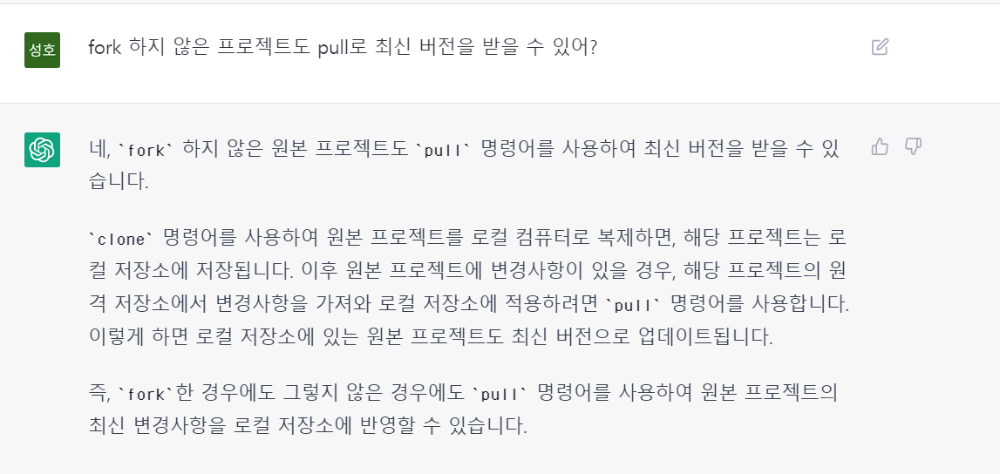

## 3주차 노트

---

### 깃허브 pull, fetch
    항상 push 전 pull 할 때, 내가 현재 작업하던 내용이 사라지지 않으면서 원격저장소의 내용을 최신화 할 수 있는 이유가 뭘까?

- 그것은 바로 `git pull` 명령어가 `git fetch` + `git merge` 이기 때문이다.
    
#### clone이란?
- `clone repository(클론 저장소)` 는 원격 저장소를 복제한 저장소이며, 다른 사람의 소스 코드 복사본을 생성하는 것과 같다.
- 보통 우리는 개발 할 때 `클론 저장소`에서 작업을 진행한다.
- `원격 저장소`에 변경 사항이 생겼을 때, 그 내용을 가져와 클론 저장소를 최신화 할 때 필요한 것이 `fetch`와 `pull`이다.

#### git fetch
    원격 저장소의 변경사항(commit)들을 로컬 저장소로 가져온다.

#### git pull
    원격 저장소의 변경 내역을 가져와 로컬에 병합한다.

즉, `git pull` 이라는 명령어는 `merge`를 수행하기 때문에 충돌이 없을 경우에는 자동으로 병합하고, 충돌이 발생할 경우에는 수동으로 해결하도록 메시지를 준다.
평소에 `git pull origin main`을 입력할 때 내 작업내용이 사라지지 않으면서 원격 저장소 내용이 최신화 된 이유는 충돌이 발생하지 않았기 때문으로 생각된다---
### fork와 clone의 차이
#### fork 
- 다른 사용자의 저장소를 자신의 GitHub 계정으로 복제하는 것.
- fork 명령어를 사용하면 원본 저장소와는 별개의 저장소가 생성된다. 따라서, fork한 저장소에서의 변경사항은 원본 저장소에 반영되지 않아서 원본 저장소에 반영하고자 하면 pull request를 해야한다.
- 원본 저장소에서 생긴 변화를 반영하고 싶으면 fetch나 rebase 과정을 진행하면 된다.


#### clone
- 다른 저장소(Repository)의 코드를 로컬 컴퓨터로 가져오는 것을 의미  
- fork와 달리, 원본 저장소의 최신 버전만 가져와서 commit 등의 로그를 보지 못한다.

    
    fork랑 clone이 딱 나뉘는 것이 아니라, 그냥 clone 해서 사용하는 것과, fork 하고 clone 해서 쓰는 것이 비교 대상이라고 이해했다.
    fork 하지 않고 clone만 하면 내 로컬 저장소에서만 이용 가능하며, fork 하고 clone하면 내 로컬 저장소에서 바꾼 내용들을 내 깃허브 계정에서 
    독립적으로 관리할 수 있는 것으로 이해했다. 


#### 둘 특징에서 마치 clone만 한 프로젝트는 원본 저장소의 변화를 반영 못 하는 것 처럼 말하는데, 컴비시간에 pull로 받아오는건 뭐지?



결론 : fork 하지 않고 clone을 하면 최신 버전을 계속 pull로 받을 수 있지만, 오직 읽기 전용으로 원본 저장소에 반영이 불가능하며, 내 로컬 저장소
에서만 이용 가능하다. fork를 하고 clone을 하면 최신버전과 log를 계속 받을 수 있으며, 내 로컬 저장소에서 깃허브 계정에 저장한 내용을 pull 
request를 통해 원본 저장소의 내용에 추가하거나 수정할 수도 있다.

---

### List와 ArrayList 차이?
- `List` 는 인터페이스이고 `ArrayList`는 List를 구현한 클래스이다.
  
        도형으로 생각할 시,
        List<> list = new ArrayList<>();
        도형 list = new 정사각형;
        arrayList<> list = new ArrayList<>();
        정사각형 list = new 정사각형;
#### 야구 게임에서 " List<Integer> computer = new ArrayList<>(); " 로 ArrayList를 선언하는 이유?

- 객체지향 프로그래밍의 일환으로, `다형성`을 지원하기 위해서이다.
- 처음부터 변경에 `유연한 구조`로 미리 설계하는 방식인 것이다.
  - 객체가 `ArrayList` 클래스가 아닌 `List` 인터페이스에만 의존하여 또다른 `List`의 구현 클래스인 `LinkedList`를 사용하게 되어도 코드를 수정할 필요가 없어진다.
```java
List<String> list = new ArrayList<>();
list.add("Apple");
list.add("Banana");

// ArrayList 타입으로 캐스팅하여 특별한 메서드 사용 가능
((ArrayList<String>)list).ensureCapacity(10); // 미리 가용 list 크기늘리는 ArrayList 전용 메소드.
```
결론 : 객체는 인터페이스를 사용해 선언하면 `다형성`을 이용하여 코드의 유연성과 확장성을 높여준다.
#### ArrayList의 고유 메서드
- trimToSize(): 리스트의 용량(capacity)을 현재 요소의 개수와 같게 조정
- ensureCapacity(int minCapacity): 리스트의 용량(capacity)을 최소한으로 지정한 값(minCapacity)보다 크게 조정

#### LinkedList의 고유 메서드
- addFirst(E e): 요소를 리스트의 첫 번째 위치에 추가
- addLast(E e): 요소를 리스트의 마지막 위치에 추가
- removeFirstOccurrence(Object o): 지정한 객체가 처음으로 나타나는 위치의 요소를 삭제
- removeLastOccurrence(Object o): 지정한 객체가 마지막으로 나타나는 위치의 요소를 삭제

---
[출처]
- https://bibi6666667.tistory.com/236