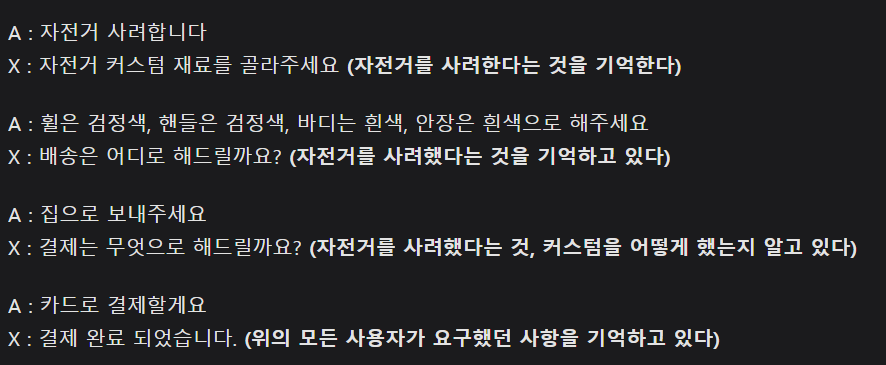
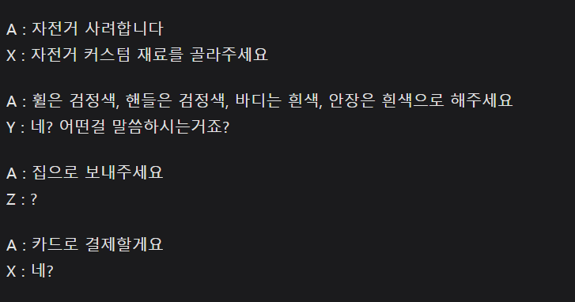
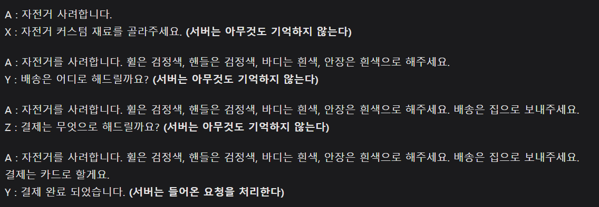
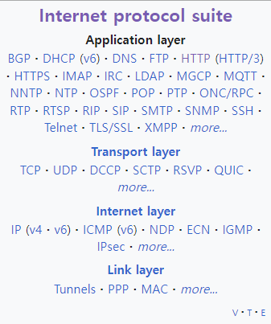

# HTTP(Hypertext Transfer Protocol)

## Q. Protocol이란 무엇인가?
## A. 공식적인 행위를 할때 필요한 규칙의 모음

 

## Q. HTTP는 어떤 규칙일까?
## A. HTML같은 문서를 전송할때 사용하는 규칙인데 application-layer에 있음, 그리고 클라이언트와 서버간의 소통을 위해 디자인됐음, Stateless하다???

 

## HTTP를 설명하기 위한 6가지 Point 
- Client / Server
- Stateless
- application layer
- client actions
- server status codes
- header

## 1. Client / Server

## 2. Stateless(무상태)
### 서버는 독립적으로 하나의 request만을 처리한다. 어떠한 데이터를 저장하고 있지 않다. 다시 말해, 클라이언트와 서버와의 관계에서 서버가 클라이언트의 상태를 보존하지 않는다.

### stateless의 반대인 stateful은 상태가 있다. 상태가 있다는 것은 반대로 클라이언트와 서버 관계에서 서버가 클라이언트의 상태를 보존함을 의미한다. 단순히 말하면 클라이언트의 이전 요청이 서버에 전달되었을 때, 클라이언트의 다음 요청이 이전 요청과 관계가 이어지는 것을 의미한다. 

### 예시
- 자전거를 판매하는 서버 X
- 자전거를 구매하는 클라이언트 A

1) 단일 서버

2) 다량의 트래픽에 의해 서버 증설

3) stateless

## 3. application layer
- internet protocol suite와 OSI model 각각에 정의가 존재함
- 각각의 모델에서 최상단이라는 공통점을 가지지만, 세부적인 차이가 있음
- 여기서는 internet protocol suite에 해당되는 application을 의미, 밑에 그림에서 4개의 layer가 존재하는데 Application layer에 HTTP가 있는 것을 확인

## 4. Clients Actions 

Clients method는 대표적으로 GET, PUT, POST, DELETE가 있음, 각각의 의미를 알기 전에 REST에 대해 먼저 짚고 넘어가야함

### 0) REST
### HTTP 만든 로이 필링이라는 사람이 있었는데, 사람들이 웹(HTTP)의 설계 우수성에 비해 장점을 잘살리지 못하는 것 같아서 웹의 장점을 최대한으로 살릴 수 있는 아키텍처로서 REST를 정의 
### 1) GET
### GET 메소드는 주로 데이터를 읽거나(Read) 검색(Retrieve)할 때에 사용되는 메소드이다.
### 2) POST
### POST 메소드는 주로 새로운 리소스를 생성(create)할 때 사용된다.
### 3) PUT
### PUT는 리소스를 생성 / 업데이트하기 위해 서버로 데이터를 보내는 데 사용됩니다.
### 4) DELETE
### DELETE 메서드는 지정된 리소스를 삭제합니다.

## 5. server status codes 
client가 server에 request를 요청하면 서버는 클라이언트의 요청과 그에 해당하는 response를 전달하게 되는데, 이 response에는 요청이 제대로 전달됐는지를 판단할 수 있는 server status code가 존재한다. ex) 404 NOT FOUND, 200 OK 등
## 6. HTTP header
HTTP 헤더는 HTTP 전송에 필요한 모든 부가정보를 담고 있다. 메시지 바디의 내용, 크기, 압축, 인증, 요청 클라이언트, 서버 정보 등등 매우 많은 정보들이 들어있다.

## 출처
- https://developer.mozilla.org/en-US/docs/Web/HTTP
- https://en.wikipedia.org/wiki/HTTPdifference-between-list-and-arraylist-in-java/
- https://roxy.iro.ooo/infra/protocol/http/http-stateful-stateless#:~:text=%EB%AC%B4%EC%83%81%ED%83%9C(Stateless)%20%2D%20%ED%81%B4%EB%9D%BC%EC%9D%B4%EC%96%B8%ED%8A%B8,%EC%88%98%EC%9B%94%ED%95%98%EA%B2%8C%20%ED%95%A0%20%EC%88%98%20%EC%9E%88%EC%8A%B5%EB%8B%88%EB%8B%A4.
- https://velog.io/@yh20studio/CS-Http-Method-%EB%9E%80-GET-POST-PUT-DELETE
- chatGPT

