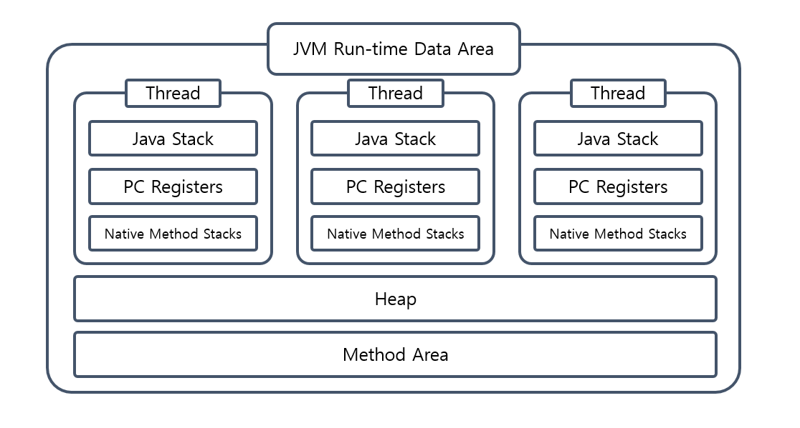

## 🔍 Java를 실행하게 되면 어떻게 될까?

## 📕 자바를 실행하면?(그림으로)

## 자바를 실행시키면? (글로 정리)

### 1. Java Source 파일을 실행시키면 JAVAC.EXE(자바 컴파일러)으로 인하여서 .class 파일(바이트코드)의 형태로 변한다.

### 2. .class의 파일을 이제 Class Loader로 넘긴 후 Class Loader가 이제 JVM의 메모리 영역(run time date area)에 적재시킨다.

### 3. 적재시키는 과정 속 JVM의 메모리 영역은 5가지의 형태로 구분이 되어져있는데 다음과 같이 적재를 시킨다.
> - Method Area: 클래스와 관련된 정보를 저장한다.
> - Heap Area: 객체와 관련된 정보들에 대해 저장한다.
> - Stack Area: 메서드 내의 관련된 정보들에 대해 저장한다.(지역안에 존재하는 변수들 등등..)
> - PC Register: Thread(쓰레드)가 생성될 때마다 생성되는 영역, 현재 쓰레드가 실행되는 부분의 주소와 명령을 저장하고 있는 영역이다. 이것을 이용해서 쓰레드를 돌아가면서 수행할 수 있게 한다.
> - Native Method Area: JAVA가 아닌 다른 언어에 대한 정보를 저장한다.(코드를 뜯어보다보면 native라는 단어가 붙은것이 있는데 그런 코드가 해당된다.)
> >  native키워드 는 자바가 아닌 언어(보통 C나 C++)로 구현한 후 자바에서 사용하려고 할 때 이용하는 키워드이다. 자바로 구현하기 까다로운 것을 다른 언어로 구현해서, 자바에서 사용하기 위한 방법이다. 구현할때 JNI(Java Native Interface)를 사용한다

그림으로 대략 보게 되면 다음과 같이 볼 수 있다.

### 4. JVM은 Method Area의 바이트 코드를 Execution Engine에 제공하여, Class에 정의된 내용대로 바이트 코드를 실행시킨다.

이때 실행 방식(Execution Engine)에는 2 가지 방식을 혼합하여 사용을 한다.

- Interpreter: 바이트코드를 한 줄씩 해석, 실행하는 방식이다. 초기 방식으로, 속도가 느리다는 단점이 있다.
- JIT(Just In Time): 그래서 나온 것이 JIT(Just In Time) 컴파일 방식이다. 바이트코드를 JIT 컴파일러를 이용해 프로그램을 실제 실행하는 시점(바이트코드를 실행하는 시점)에 각 OS에 맞는 Native Code로 변환하여 실행 속도를 개선하였다.

#### 💥 참고
그러나, 바이트코드를 Native Code로 변환하는 데에도 비용이 소요되므로, JVM은 모든 코드를 JIT 컴파일러 방식으로 실행하지 않고, 인터프리터 방식을 사용하다 일정 기준이 넘어가면 JIT 컴파일 방식으로 명령어를 실행한다.

### ❗ 실행되는 과정중
그런데! Java에서는 메모리를 관리해주는 모듈인 JVM의 Garbage Collector라는 것이 동작하는데 더 이상 참조되지 않은 객체들을 자동으로 제거를 한다. 주로 Heap 영역에서 일어나게 되는데 5가지의 영역이 또 나뉘어진다.

- Minor GC: 앞의 3 부분 New로 인하여 새로 생성된 부분에서 일어나는 Garbage Collector를 의미한다.
    - Eden이 가득찼을 때 실행
    - 속도가 빠름
- Major GC: 뒤쪽의 Old 부분부터 일어나게 되는 Garbage Collector를 의미한다.
    - Old가 가득찼을 때 실행
    - 속도가 느림

### 간단하게 설명하면 이렇게 설명이 됩니다.
더 자세하게 살펴보기 위하여서는 이전 시리즈에서 작성하였던 JVM의 기능에 따라 정리한 글과 밑에 출처들을 참고하시면 좋을 거 같습니다.

[JDK, JRE, JVM](https://velog.io/@nandong1104/Java%EB%A5%BC-%EC%8B%A4%ED%96%89%ED%95%98%EB%A9%B4-%EC%96%B4%EB%96%BB%EA%B2%8C-%EC%A7%84%ED%96%89%EC%9D%B4-%EB%90%98%EB%82%98%EC%9A%94-1.-JDK-JRE-JVM-%EC%9D%98-%EC%97%B0%EA%B4%80-%EA%B4%80%EA%B3%84)
[Class Loader](https://velog.io/@nandong1104/Java%EB%A5%BC-%EC%8B%A4%ED%96%89%ED%95%98%EB%A9%B4-%EC%96%B4%EB%96%BB%EA%B2%8C-%EC%A7%84%ED%96%89%EC%9D%B4-%EB%90%98%EB%82%98%EC%9A%94-2-1.-JVM-ClassLoader)
[Execution Engine](https://velog.io/@nandong1104/Java%EB%A5%BC-%EC%8B%A4%ED%96%89%ED%95%98%EB%A9%B4-%EC%96%B4%EB%96%BB%EA%B2%8C-%EC%A7%84%ED%96%89%EC%9D%B4-%EB%90%98%EB%82%98%EC%9A%94-2-2.-JVM-Execution-Engine)
[Run Time Data Area](https://velog.io/@nandong1104/Java%EB%A5%BC-%EC%8B%A4%ED%96%89%ED%95%98%EB%A9%B4-%EC%96%B4%EB%96%BB%EA%B2%8C-%EC%A7%84%ED%96%89%EC%9D%B4-%EB%90%98%EB%82%98%EC%9A%94-2-3.-JVM-Run-Time-Data-Area)
[Garbage Collector](https://velog.io/@nandong1104/Java%EB%A5%BC-%EC%8B%A4%ED%96%89%ED%95%98%EB%A9%B4-%EC%96%B4%EB%96%BB%EA%B2%8C-%EC%A7%84%ED%96%89%EC%9D%B4-%EB%90%98%EB%82%98%EC%9A%94-2-4.-Garbage-Collector)

## 😲 여기서 끝인가?
실제로 조사해보면서 알게 된 것이 정리해놓은 글보다 더 많은 글 더 많은 자료들이 많았다. 그것에 대하여서는 계속해서 수정하고 글들을 보완해나가는 것이 중요할 것 같다.

## 출처
- [https://tecoble.techcourse.co.kr/post/2021-08-09-jvm-memory/](https://tecoble.techcourse.co.kr/post/2021-08-09-jvm-memory/)
- [https://jeong-pro.tistory.com/148](https://jeong-pro.tistory.com/148)
- [java-stack-heap Baeldung](https://www.baeldung.com/java-stack-heap)
- [Java Memory Management](https://www.geeksforgeeks.org/java-memory-management/)
- [Native Methods and the Java Native Interface, IBM](https://www.ibm.com/docs/en/i/7.2?topic=languages-native-methods-java-native-interface)
- [Getting started with Java native methods](https://www.ibm.com/docs/en/i/7.2?topic=interface-getting-started-java-native-methods)
- [Java SE 8 document, Oracle](https://docs.oracle.com/javase/specs/jvms/se8/html/jvms-2.html)
- [https://www.geeksforgeeks.org/jvm-works-jvm-architecture/?ref=lbp](https://www.geeksforgeeks.org/jvm-works-jvm-architecture/?ref=lbp)
- [https://blogs.oracle.com/javamagazine/post/how-the-jvm-locates-loads-and-runs-libraries](https://blogs.oracle.com/javamagazine/post/how-the-jvm-locates-loads-and-runs-libraries)
- [https://m.blog.naver.com/ksw6169/221647376178](https://m.blog.naver.com/ksw6169/221647376178)
 
