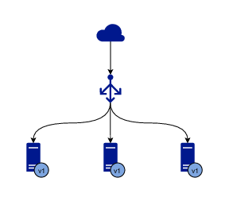
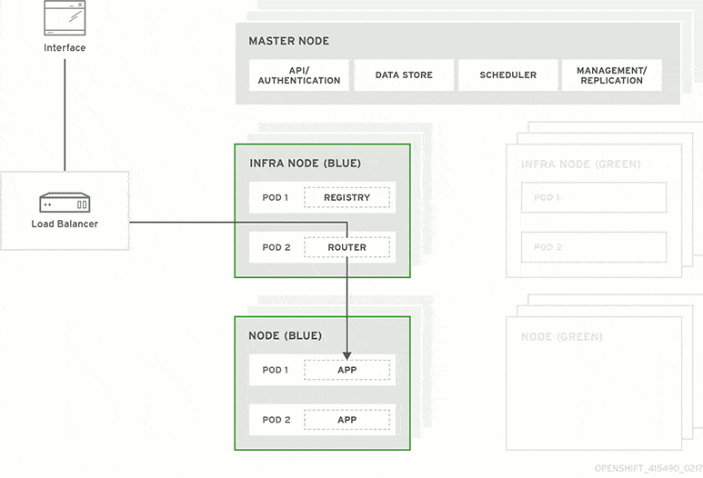
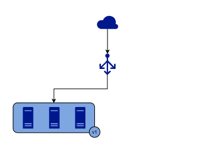

## 무중단 배포를 알고 계신가요?

이 글을 작성하게 된 이유는 최근 어느 커뮤니티에서 대화를 나누는 도중 ci/cd에 대해서 어떻게 구현한 것인지에 대한 질문이 있었는데 그에 대한 답변에 대해서 스스로 바로 떠오르지 못했기 때문에 이번 글을 작성하게 되었다.

## 고민에 빠지게 된 질문

> 무중단 배포가 뭘까요?

그래서 여러가지 키워드가 나왔었는데  `blue-green`, `kanari` 등등의 키워드가 나왔는데 처음 들었다.
솔직히 말해서 그래서 이번 기회에 정리하고 이와 관련해서 무중단 배포를 어떻게 진행하는지 알아보기 위해서 이 글을 작성하게 되었다.

먼저 무중단 배포도 중요하긴 하지만 어쩌다 이런 단어가 나온지 확인하자. 가장 많이 듣는 키워드로는 `CI/CD` 라는 키워드에서 계속가다가 `무중단 배포`라고 나오게 되었다.

먼저 알고가면 좋은 용어

### 용어 정리

- 온 프레미스 
>기업의 서버를 클라우드와 같이 '가상의 공간'이 아니라, 자체적으로 보유하고 있는 서버에 직접 설치하고 운영하는 방식
- 로드 밸런싱
>로드 밸런싱은 들어오는 네트워크 트래픽을 서버 팜 또는 서버 풀이 라고도 하는 백엔드 서버 그룹에 효율적으로 분산시키는 것을 말합니다 .

- 로드 밸런서
>로드 밸런서는 서버 앞에 앉아 있는 "교통 경찰" 역할을 하며 속도와 용량 활용도를 최대화하고 어느 한 서버도 과로하지 않도록 하여 성능을 저하시킬 수 있는 방식으로 이러한 요청을 이행할 수 있는 모든 서버에 클라이언트 요청을 라우팅합니다. . 단일 서버가 다운되면 로드 밸런서는 나머지 온라인 서버로 트래픽을 리디렉션합니다. 새 서버가 서버 그룹에 추가되면 로드 밸런서가 자동으로 해당 서버에 요청을 보내기 시작합니다.

## CI/CD

### CI

- Countinuous Integration의 약자
- 애플리케이션 코드의 새로운 변경 사항이 정기적으로 빌드 및 테스트 거쳐 공유 repository에 병합되는 과정
- 동시에 여러 개발자가 동시에 관련 코드 개발 시 서로 충돌하는 문제를 이 방법으로 해결한다.

### CD

- 2 가지의 CD 뜻이 있다. (두 용어를 상호 교환하여 사용한다. 얼마나 많은 자동화가 이루어지고 있는지 설명하기 위해 사용)
  - Countinuous Delivery : 지속적인 서비스 제공
  - Countinuous Deployment : 지속적인 배포
- 지속적인 배포란?
  - 개발자의 변경 사항을 repository에서 고객이 사용 가능한 프로덕션 환경까지 자동으로 릴리스 하는 것
  - 수동 프로세스로 인한 운영팀의 프로세스 과부하 문제 해결
  - 파이프라인의 다음 단계 자동화를 통하여 지속적인 서비스 제공의 장점을 활용한다.

### 유명한 CI/CD Tools    

- Buddy: Buddy는 안정적인 전달 파이프라인을 제공하는 CI/CD 도구입니다. Docker 컨테이너를 기반으로 작업을 구성하고 모니터링하며, 사용자 친화적인 인터페이스를 제공합니다.
- Jenkins: Jenkins는 오픈 소스 CI 서버로서 많은 플러그인을 지원하며 다양한 통합 옵션을 제공합니다. 다양한 개발 환경에서 유연하게 사용할 수 있습니다.
- TeamCity: TeamCity는 Java 기반의 CI 서버로서 코드 품질 분석, 지속적인 단위 테스트 등의 기능을 제공합니다. 다양한 툴과의 통합을 지원하며 테스트와 릴리스 관리를 용이하게 합니다.
- GoCD: GoCD는 무료 오픈 소스 CI/CD 서버로, 병렬 실행, 빌드 비교, 엔드 투 엔드 시각화 등 다양한 기능을 제공합니다. 개발 프로세스의 효율성을 향상시킬 수 있습니다.
- Bamboo Data Center: Bamboo는 Atlassian의 CI/CD 파이프라인 도구로서 빌드 관리와 CD 파이프라인 설정을 지원합니다. Jira와의 완전한 통합을 제공하여 개발 프로세스를 향상시킵니다.

등등 되게 많다. 그렇지만 우린 궁금했던 것은 무중단 배포가 무엇인지에 대해서였다.

## 무중단 배포가 뭐냐?

일단 말 뜻을 제대로 이해하기 위해서 예시 상황이 있다. 
>**내가 어떤 서비스를 버전업을 시킬려고 한다 현재 버전은 `v1`이다.** 이제 여러 기능을 추가시킨 `v2`를 사용할 수 있게 배포를 해야 한다.
**우리는 사용자들이 우리가 버전을 바꾸는데 전혀 인지하지 못하도록 서비스가 중지되지 않도록 365일 계속 가동되는 것을 목표로 한다.**

### 일반적인 배포 방식

일반적으로 배포를 할려면 어떤 과정을 거쳐야 할까?
1. 새로 만든 v2 버전 빌드 서버에 다운로드 
2. V1 버전과 V2 버전은 서로 같은 포트를 사용하므로, V2 버전을 실행하기 전에 먼저 현재 실행중인 V1 버전의 프로세스를 종료해야한다. 
3. 이 시점부터 유저는 서비스를 사용할 수 없게 된다. 유저가 새로운 V2 버전으로 접속할 수 있도록 바로 V2 빌드를 실행한다. 
4. 로딩과정을 거치고 V2 버전이 정상적으로 실행되면 유저가 다시 정상적으로 서비스를 이용할 수 있게 된다.

### 이러면 문제점이 뭘까?

만약 게임을 사용하는 클라이언트의 입장이 되어볼까? 갑자기 개발자가 `새 버전 올려야겠다` 하고 배포를 했다.
그러면 예를 들면 `LOL`과 같은 게임을 하다가 서비스를 사용할 수가 없는데 이 상황은 마치...

### 게임의 폭력성을 알기 위해 PC방의 전원을 꺼버리는 상황

너무 유명한 위의 사진과 같은 경우가 아닐 수 없다. 개발자가 클라이언트의 폭력성을 체험시키게 할 필요는 없어 보인다.
아래와 같은 상황이 어찌보면 사람 손이 아닌 개발자 손에서 일어나는 거랑 비슷한 경우라고 볼 수 있다.

결국 이러한 상황을 겪지 않기 위해서 지속적으로 365일 가동하는 서비스들은 `무중단 배포`를 꼭 사용해야 한다.

### 그래서 무중단 배포(Zero-Downtime-Deployment)를 해야 한다.

### 무중단 배포를 할 수 있는 방법 3가지

### 1. Rolling Deployment
> 트래픽을 점진적으로 구버전에서 새 버전으로 옮기는 방식이다. 

### 1번 방식

1. 인스턴스를 하나 추가하고, 새로운 버전을 실행한다. 
2. 로드 밸런서에 이 인스턴스를 연결하고, 기존 구버전 어플리케이션이 실행되는 인스턴스 하나를 줄인다.

서버 개수를 유연하게 조절할 수 있는 AWS와 같은 클라우드를 기반으로 서비스를 운영할 때 적합한 방식일 것 같다.

이런 방식이 대표적이지만 다른 방식도 여러가지 있는 것으로 알고 있다. 

### 2번 방식 

1. V1이 실행되고 있는 서버 하나를 로드밸런서에서 떼어낸다.(이러면 해당 서버에 트래픽 도달 X) 
2. 이 상태에서 해당 서버의 어플리케이션을 V2로 교체한다. 
3. 이 과정을 반복해서 모든 서버를 새로운 버전으로 교체한다.

이런 방식은 클라우드 환경이 아닌, 물리적인 서버로 서비스를 운영하는 상황에서도 사용할 수 있을 것이다.

### 일반적인 롤링을 그림으로 보면

### 이러면 질문이 하나 생긴다.
> v2 버전 1개 v1 버전 2개인 서버가 생기지 않냐?

맞다. 이것이 롤링 배포의 단점에 해당된다.

### 장점

- 현재 버전이 라이브로 유지되므로 가동 중지 시간 최소화
- 최소 하나의 추가 노드 필요(블루-그린 배포와 같은 전체 복제 인프라 대신)
- 롤백이 필요한 경우 모든 트래픽을 이전 버전으로 되돌릴 수 있다.

### 단점

- 애플리케이션이 실행 중인 인스턴스 수에 따라 새 버전 배포를 시작하는 순간과 모든 것이 활성화되는 순간 사이에 상당한 대기 시간이 발생할 수 있다.
- 배포 프로세스 중간에 오류가 발생하면 롤백하는 데 정말 많은 시간이 소요될 수 있다.
- **이전 버전과 새 버전이 공존하게 될 수 있기 때문에 약간의 위험이 수반되야 한다.**

---

### Blue-Green Deployment
> 청록색 배포는 원래 환경과 복제 환경을 갖는 것으로 시작됩니다. 이렇게 하면 새 애플리케이션을 동시에 배포하는 동안 이전 환경을 보존할 수 있습니다.

트래픽을 한번에 구버전에서 신버전으로 옮기는 방법이다. 

- Blue: 현재 운영중인 서비스(구)
- Green: 바꿀 버전(신)

Blue와 Green의 서버를 동시에 나란히 구성해둔 상태로 배포 시점에 로드 밸런서가 트래픽을 Blue에서 Green으로 일제히 전환시킨다. Green 버전 배포가 성공적으로 완료 되었고, 문제가 없다고 판단했을 때에는 Blue 서버를 제거할 수 있다. 혹은 다음 배포를 위해 유지해둘수 있다.

### 장점
- 롤링 배포와 달리 한번에 트래픽을 모두 새로운 버전으로 옮기기 때문에 호환성 문제가 발생하지 않는다.

### 단점
- 인프라를 두 배로 늘리면 리소스 비용이 두 배로 늘어난다. 추가 리소스가 배포 후 즉시 제거될 수 있는 클라우드 서비스 공급자에 의존하는 경우 이러한 비용 증가는 일시적일 수 있습니다.
- 두 환경을 동기화하고 최신 상태로 유지하는 것은 어려울 수 있다.
- 자동화된 테스트에서 감지되지 않은 오류의 경우 새 인스턴스로 라우팅된 모든 요청이 영향을 받습니다.

---

### Canary Deployment

> 카나리 단어의 유래 : 예전 광부들이 가스에 예민한 카나리아 새를 활용하여 가스 누출을 감지했다는 이야기에서 유래되었다.

> 카나리 배포는 애플리케이션이 소규모 배치로 배포되는 경우입니다. 초기에 배포되면 소수의 사람들에게만 적용됩니다. 그런 다음 단계적 릴리스에서 점진적으로 배포가 계속됩니다.

### 이 말이 무슨 말이냐. 

위 gif처럼 점진적으로 v1 -> v2로 옮겨가는 것이다.

기본적으로는 롤링 배포 방식과 비슷한 부분이 있다. 그렇지만 **카나리 배포의 핵심은 새로운 버전에 대한 오류를 조기 감지하는 것이다.**

소수 인원에 대해서만 트래픽을 새로운 버전에 옮겨둔 상태에서 서비스를 운영한다.(오류를 감지하기 위해)
새로운 버전에 이상이 없다고 판단하였을 경우에 모든 트래픽을 신규 버전으로 옮긴다. 이때, 트래픽을 새로운 버전으로 옮기는 기준은 정해진 규칙(특정 유저 등) 혹은 랜덤이다.

### 장점

- 오류를 조기 발견하여 위험을 최소화 한다.

### 단점
- 롤링 배포와 마찬가지로 신, 구 버전이 동시에 존재해서 **이전 버전과 새 버전이 공존하게 될 수 있기 때문에 약간의 위험이 수반되야 한다.**

---

### 출처

- https://www.encora.com/insights/zero-downtime-deployment-techniques-rolling-update
- https://www.encora.com/insights/zero-downtime-deployment-techniques-canary-deployments
- https://www.redhat.com/ko/topics/devops/what-is-ci-cd?cicd=32h281b
- https://www.koyeb.com/blog/blue-green-rolling-and-canary-continuous-deployments-explained#rolling-deployment
- https://hudi.blog/zero-downtime-deployment/#:~:text=downtime
- https://docs.aws.amazon.com/whitepapers/latest/overview-deployment-options/rolling-deployments.html
- https://www.nginx.com/resources/glossary/load-balancing/