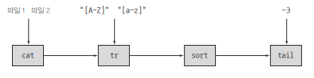
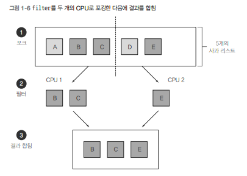

## CH1. 자바 8,9,10,11 무슨 일이 일어났는가?


### 본격적으로 들어가기 전 다룰 내용 간접 설명
- 자바 8에서 큰 변화가 일어남.
- 멀티코어 CPU 대중화에 따른 하드웨어적 변화도 자바 8에 영향을 미침
  - 이전까지는 자바 프로그램은 코어 중 하나만을 사용
  - 자바 5 : 스레드 풀, 병렬 실행 컬렉션 도입
  - 자바 7: 포크/조인 프레임워크 제공 개발자 활용하기가 어려웠음
  - 자바 8 : 개발자가 쉽고 단순한 방식으로 병렬실행을 접근할 수 있도록 함.
  - 자바 9 ; 리액티브 프로그래밍 병렬 실행 기법 지원
- 자바 8은 간결한코드, 멀티코어 프로세서의 쉬운 활용 요구사항을 기반으로 한다.
- 자바 8 핵심 기능
  - 스트림 API
  - 메서드에 코드 전달하는 기법
  - 인터페이스의 디폴트 메서드


### 왜 아직 자바는 변화하는가?

자바 시작이 1995년 첫 베타 버전 공개 이후로 커다란 생태계 성공적으로 구축

- 자바 8은 더 다양한 프로그래밍 도구 다양한 프로그래밍 문제를 더 빠르고 정확하며 쉽게 유지보수할 수 있는 장점 제공
- 자바 8의 핵심 3 가지 프로그래밍 개념에 대해 본격적으로 다루면서 배워가보자.

### 1. 스트림 처리

> 스트림 : 한 번에 한 개씩 만들어지는 연속적 데이터 항목의 모임
> ex) 입력 스트림 한 개씩 읽고 출력 스트림으로 한 개씩 기록 `System.in`, `System.out`


- 자바 8 에서 `java.uti.Stream` 패키지에 스트림 API가 추가됨.
  - 핵심
  - 
    - 자동차 조립할 때 각 구조품을 동시에 생산하는 생산 라인이라고 생각하면 편함.
      - 기존에는 한 번에 한 항목씩 처리한 방식이었지만 고수준으로 추상화해서 일련의 스트림으로 만들어 처리 할 수 있게 됨.
      - 스트림 파이프라인을 이용해 입력 부분을 여러 CPU 코어에 쉽게 할당 -> 위 유닉스의 형태처럼 나눠서 병렬적으로 처리할 수 있게 됨.
      - 스레드라는 복잡한 작업 사용 X -> 공짜로 병렬성을 얻을 수 있었음.

### 2. 동작 파라미터화로 메서드에 코드 전달하기

- 자바 8에서는 메서드를(우리 코드) 다른 메서드의 인수로 넘겨주는 기능 제공
    - 이것을 동작 파라미터화라고 부름!

### 3. 병렬성과 공유 가변 데이터

- 이 개념은 `병렬성을 공짜로 얻을 수 있다`라는 말에서 시작됨.
- 보통은 다른 코드와 동시에 실행 하더라도 **안전하게 실행**하려는 코드를 만들려면 공유된 가변 데이터에 접근 못하게 해야함.
  - 이런 함수를 `순수 함수`, `부작용 없는 함수`, `상태 없는 함수`라고 불리워진다.
- 공유된 변수나 객체가 있으면 병렬성 문제가 발생한다.
  - 보통 `syncronized를 이용해 보호하는 규칙을 만듦` -> 하지만 시스템 성능에 악영향을 미친다.
    - 악영향 이유 : 다중 처리 코어에서 코드가 순차적으로 실행되어야 해서 병렬이라는 목적을 무력화 훨씬 비싼 비용이 들게 됨/
  - 그래서 자바 8 스트림을 활용하면 기존의 자바 스레드 API 보다 쉽게 병렬성을 활용할 수 있다.


### 자바가 진화해야 하는 이유

- 진화를 해가면 해 갈수록 좋아짐. -> 컴파일 할 때 더 많은 에러 검출, 리스트 유형을 아는 등등등
- Iterator 방식이 아닌 for-each문을 통하여서도 -> 고전적 객체지향이 아닌 함수형 프로그래밍으로 다가서고 있음.
- 결론 : 언어는 하드웨어나 프로그래머의 기대의 변화에 부응하는 방향으로 변화해야 한다는 것


### 자바 함수

- 자바 8에서는 함수를 새로운 값의 형식으로 추가함. 
  - 멀티코어에서 병렬 프로그래밍을 활용할 수 있는 스트림과 연계할 수 있게 함수를 만들었기 때문
- 프로그래밍 언어의 핵심은 **값을 바꾸는 것이다.**
  - 역사적으로 이러한 값들을 일급값이라고 부른다.
    -  > 첫 번째로 42(int 형식), 3.14(double
       형식) 등의 기본값이 있다. 두 번째로 객체(엄밀히 따지면 객체의 참조)도 값이다. new 또는
       팩토리 메서드 또는 라이브러리 함수를 이용해서 객체의 값을 얻을 수 있다. 객체 참조는 클래
       스의 인스턴스instance를 가리킨다. 예를 들어 “abc”(String 형식), new Integer(1111) (Integer
       형식), new HashMap<Integer, String>(100) (HashMap의 생성자를 호출) 등으로 객체 참조를
       얻을 수 있다
  - 자바에서 메서드, 클래스가 값의 구조를 표현하는데는 도움이 되어도 모든 구조체를 자유롭게 전달 불가(2급 자바 시민이라고 함) - 
  - 2급 시민을 1급 시민으로 바꾸는 작업이 필요하다.
    - ex) 메서드를 일급 시민으로 만들어서 런타임에 메서드를 전달할 수 있다면 프로그래밍에 유용하게 활용 가능
  

### 메서드와 람다를 일급 시민으로


- 자바 8의 설계자들은 메서드를 값으로 취급할 수 있게, 그로 인하여 프로그래머들이 더 쉽게 개발할 수 있게 하기로 결정

```java
//기존 방식
File[] hiddenFiles = new File(".").listFiles(new FileFilter() {
 public boolean accept(File file) {
 return file.isHidden();
 }
});

// 바뀐 방식
File[] hiddenFiles = new File(".").listFiles(File::isHidden);
```

위 예시처럼 기존 방식대로 하면 원래의 File안에 isHidden이라는 메서드가 있는데 복잡하게 감싼 다음에 보내줘야 했다.  

왜냐하면 달리 방법이 없었기 때문이다. 그런데 아래 처럼 자바 8에서처럼 구현을 하니 참으로 간결해졌다. 그리고 직관적으로 알 수 있었다.

여기서 사용된 것이 자바 8의 **메서드 참조** `::(이 메서드를 값으로 사용해라)`였다.


이렇게 값으로 사용하면 위에서 얘기했던 것처럼 이제는 이급 값이 아니라 일급값으로 사용할 수 있다는 것이다.


### 람다: 익명 함수

- 자바 8에서는 심지어 메서드를 일급값으로 취급할 뿐만 아니라 **람다(또는 익명 함수)**를 포함하여 함수도 값으로 취급할 수 있다. 
- ex) (int x) -> x+1 x라는 인수로 호출하면 x+1을 반환 하는 동작을 수행하도록 코드를 구현하는 것처럼 말이다.
- 특정 항목을 선택해서 반환하는 동작을 `필터`라고 부른다.
- 위에서 설명한것처럼 뭐 책의 예제에서 나오는대로 하면 Apple::isGreenApple 이런식으로 메서드 참조를 이요할 수 있다.
  - filterApples(inventory, (Apple a) -> GREEN.equals(a.getColor())
    - 이러한 방식으로 진행한 이유는 기능 한 번 사용하기 위해 굳이? 메서드를 만들어? 라는 것이기 때문이다.
- **핵심은 한 번만 사용할 메서드를 따로 정의를 구현할 필요가 없다는 것이다.** 

### 스트림

- 거의 모든 자바 애플리케이션은 컬렉션을 만들고 활용한다.
  - 그런데 컬렉션만으로 모든 문제가 해결되지는 않는다.
- 스트림 API를 사용해 컬렉션 API와 상당히 다른 방식으로 데이터를 처리할 수 있다는 것을 이 항목에선 기억해야 한다.
- for-each루프 를 활용해서 각 요소 반복해서 작업 수행하면 이것을 **외부 반복**이라고 한다.
- 반면에 스트림 API를 이용하면 루프를 신경쓰지 않고 라이브러리 내부에서 모든 데이터가 처리되는 방식을 **내부 반복**이라고 한다.


### 멀티 스레딩은 어렵다


- 이 대목에서 집중해야 할 부분은 기존의 스레드 API로 멀티스레딩 코드를 구현해서 병렬성을 이용하는게 쉽지 않다.
- 스트림 API를 활용해 자바 8에서는 컬렉션을 처리하면서 발생하는 모호함과 반복적인 코드 문제, 멀티 코어 활용 어려움 두 가지 문제를 해결했다.
  - 반복되는 패턴을 필터링하거나, 데이터를 추출하거나, 데이터를 그룹화하는 등의 기능을 활용해서 말이다.
  - 한 리스트가 있다고 했을때 책에 나오는 예제를 참고해서 생각하면 5개의 리스트가 있다.
    
    - 앞 3개는 1번 CPU에, 뒤 2개는 2번 CPU에 처리하라고 시킨다.
      - 이 과정을 포킹 단계라고 한다.
    - 그리고 각각 맡은 리스트를 필터링 한다.
    - 나중에 결과를 합친다.
- **컬렉션은 어떻게 데이터를 저장하고 접근할지에 중점**
- **스트림은 데이터에 어떤 계산을 할 것인지 묘사한다는 것에 중점**
  - 쉽게 스트림 내의 요소를 병렬로 처리할 수 있는 환경을 제공하는게 핵심이다.

- 컬렉션을 필터링할 수 있는 가장 빠른 방법!
  - 컬렉션을 스트림으로 바꾸고
  - 병렬로 처리하고
  - 리스트로 다시 복원
- 스트림과 람다 표현식을 이용해 병렬성을 공짜로 얻어서 병렬로 필터링하라는 것


아래 순차 방식, 병렬 방식 코드다.


```java

import static java.util.stream.Collectors.toList;
List<Apple> heavyApples =
 inventory.stream().filter((Apple a) -> a.getWeight() > 150)
 .collect(toList());


//다음은 병렬 처리 방식의 코드다.
import static java.util.stream.Collectors.toList;
List<Apple> heavyApples =
 inventory.parallelStream().filter((Apple a) -> a.getWeight() > 150)
 .collect(toList());

```


### 디폴트 메서드와 자바 모듈

- 보통 자바에서는 특별한 구조가 아닌 평범한 자바 패키지 집합을 포함하는 JAR 파일을 제공
- 자바 8,9에서는 다른 방법으로 해결, 패키지 모음을 `모듈`이라고 정의
- 자바 8에서는 인터페이스를 쉽게 바꿀 수 있게 디폴트 메서드 지원
  - 위 예시의 코드에 만약 List에 stream, paralllStream이 없었다면 코드 내부로 들어가서 계속 메서드 추가하고 ~~~ 했어야 했다 ㅠㅠ
  - 그러나 자바 8에서는 구현 클래스에서 구현 안 해도 메서드를 인터페이스에 추가할 수 있는 기능을 제공한다.
    - 클래스 구현이 아니라 인터페이스의 일부로 포함할 수 있어 `디폴트 메서드라고 부름`

### 함수형 프로그램잉에서 가져온 다른 유용한 아이디어

- 지금까지 자바에 포함된 함수형 프로그래밍의 핵심적인 두 아이디어를 살펴봤다. 
- 1.  메서드와 람다를 일급값으로 사용하는 것이고
- 2. 다른 하나는 가변 공유 상태가 없는 병렬 실행을 이 용해서 효율적이고 안전하게 함수나 메서드를 호출할 수 있다는 것이다. .

그래서 다른 것은 결론적으로 null 처리 방법과, 패턴 매칭 활용 등 흥미로운 기법들이다.


### 그래서 요약

- 멀티코어 프로세서를 온전히 활용하기 힘들었던 이전 버전에서 자바 8 을 사용하며 활용하기 시작하였다.
- 함수는 일급값이다. 값을 변화시킬 수 있게 만들었다. 어떻게 함수형으로 넘겨주게 되었는지? -> :: 메서드 참조, 람다를 사용한다.
- 스트림의 일부 개념은 컬렉션에서 가져와서 적절하게 스트림, 컬렉션을 활용하면 인수를 병렬로 처리 , 가독성 좋은 코드를 구현할 수 있다.
- 디폴트 메서드를 활용해서 기존 인터페이스를 구현하는 클래스를 바꾸지 않고 인터페이스를 변경할 수 있었다.
- 함수형 프로그래밍에서 null 처리 방법, 패턴 매칭 활용 등 흥미로운 기법 활용
