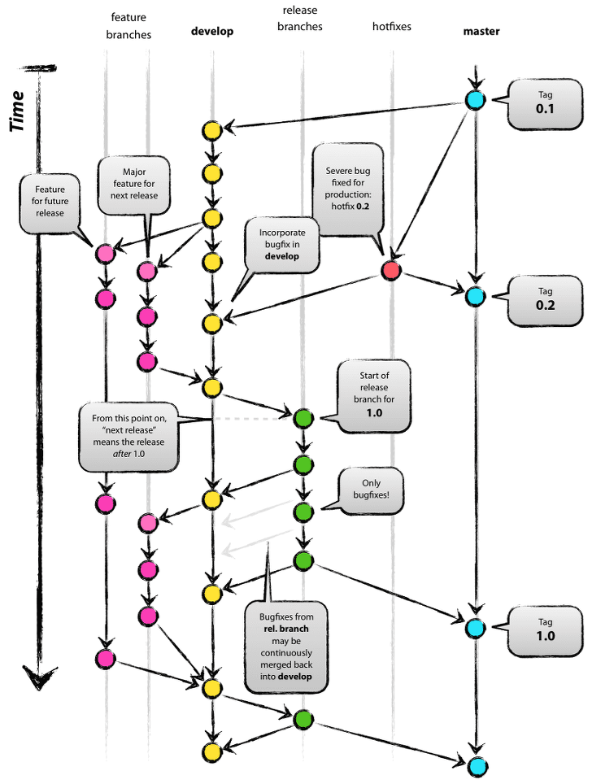
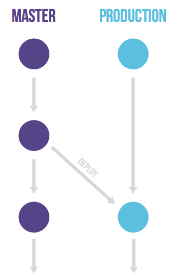

## 기업에서는 어떻게 깃을 통해 관리를 할까?

갑자기 문득 이런 고민이 생겼다. **코드를 적다가 같은 백엔드의 프로젝트를 진행한다면? 서로 다른 작업을 하다가 무조건 겹칠 수밖에 없을 거 같은데?**
라는 생각이 들어서 한번 주변 분들에게 물어보기도 하며 찾아보기 시작했었다. 그러다 다들 공통적으로 말씀하신 것이 `Git workflow`에 대해서 찾아보세요. 라는 답변을 들어 한 번 찾아보게 되었다.

### Git Workflow

>Git workflow : 팀에서 브랜치를 어떻게 사용할 지에 대한 규칙을 `workflow`라고 하는데 Git을 사용한 가장 대표적 Workflow는 `Git flow`, `Github flow`, `Gitlab flow`가 있다.

### Git flow

대규모 프로젝트에 적합한 방법이다. 5개의 브랜치로 관리를 한다. `master`, `develop`이 주이고 보조 브랜치로 `feature`, `release`, `hotfix`로 나눈다고 한다. 

다음 그림과 같이 진행이 되는데 각각의 용도는 다음과 같다.

- Master
  - 릴리즈 할 때 최종 단계의 메인 브랜치
  - Master 브랜치는 릴리즈 기록을 담는다.
  - 태그를 통해 versioning을 한다.
- Develop
  - 다음 릴리즈 버전 개발을 진행하는 브랜치
  - 기능 구현이 필요하면 Develop 브랜치에서 다시 브랜치를 내어 개발
  - 개발 완료된 기능은 다시 Develop 브랜치로 병합
- Feature
  - Develop 브랜치에서 기능 구현을 이유로 브랜치를 낼 때 나오는 브랜치
  - 브랜치를 내는 기준은 한 기능 단위가 된다?!
- Release
  - Develop 브랜치에서 파생되는 브랜치
  - 현재 코드가 Master 브랜치로 병합될 수 있는지 테스트하는 브랜치
  - 테스트 과정에서 발생한 버그를 고치는 역할 담당
  - 이상 없으면 Release -> Master로 병합된다.
- Hotfix
  - Master브랜치에서 Hotfix브랜치를 내어 버그를 수정한다.
  - 디버그 완료 후 Master브랜치와 Develop브랜치에 병합해주고 브랜치를 닫는다.

### 단점

이 브랜치 전략은 엄격하다. 그래서 어찌보면 계획적인 릴리즈를 스케줄하는 대규모 프로젝트에 적합한 방식이다. 결국 너무 까다롭게 절차를 준수하기 때문에 생산성이 떨어진다는 얘기도 나온다.
그래서 제시된 방식이 `Github flow`, `Gitlab flow` 이다.

### Github flow

- Master
  - 릴리즈에 있어 절대적 역할 담당
  - 항상 최신 버전을 유지
  - 무조건적으로 stable한 상태 담보
- Feature
  - Develop 브랜치가 존재하지 않고 Feature브랜치가 생성, 병합된다.

Merge할 때 무조건 pull request를 하고 코드에 대한 검토를 받도록 한다. CI가 필수적이다.

### Gitlab flow

Gitlab flow가 나온 이유는 Github flow에서 보완하기 위해서이다. 

- Production
  - Git flow의 Master 브랜치역할과 같다.
  - Master 브랜치가 Production 브랜치로 병합한다.
  - Production 코드에서 릴리즈된 코드가 항상 최신버전을 유지하지 않아도 된다.

### 출처

- https://onwah.tistory.com/12
- https://techblog.woowahan.com/2553/
- https://velog.io/@pond1029/Git-Workflow
