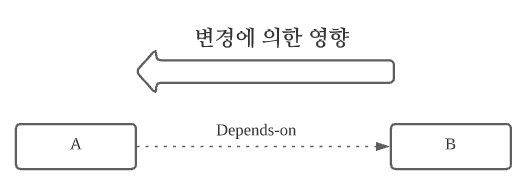
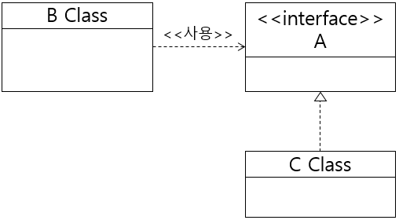

## 의존성

DI에 대해서 보기전에 우선 의존성이라는 단어에 대해서 생각해 볼 필요가 있다.

객체의 관점에서 보게 되면 A, B클래스가 있다고 할 때 A클래스에서 B클래스를 사용한다고 하면 다음과 같을거다.

```java

public class B{
    
   /* void method1(){

        System.out.println("hello");
        
    }*/
    
    void method2(){
        System.out.println("hello world");
    }
    
    
}
public class A{
    
    B b = new B();
    b.method1();
    
}
```




위 경우 처음엔 A 클래스는 B 클래스에 의존한다고 말을 한다. 왜냐하면 B클래스의 method1을 method2로 바꾸게 된다면 기존의 A 클래스에 있던 method1이라고 호출했던 부분까지 변경의 영향이 가게 된다. 이랬을때 `A 클래스는 B 클래스에 의존한다.` 라고 표현을 한다.

그리고 또 다른 말로 표현하면
> 한 클래스나 객체가 다른 클래스나 객체를 사용하거나 다른 클래스나 객체와 상호작용을 하는 것을 의존성이라고 표현한다.


**책에서는 의존하는 유형에는 2가지가 있다고 얘기를 한다.**

- 클래스 의존
- 인터페이스 의존


### 클래스 의존

```java

public class A{
    
    B b = new B();
    b.method1();
    
}

public class B{

void method1(){
    
}

}


public class C{

void method2(){
    
}

}
```

위에 있는 A에서 B의 method1을 사용하고 있었는데 만약 여기서 C 클래스의 method2를 사용하고 싶다면 어떻게 해야할까? B객체를 C객체로 바꾸고 호출하는 부분도 바꿔야한다. 그러니까 **즉, 말하자면 클래스에서의 의존성이라는 것은 한 클래스에서 변경이 일어날때 다른 클래스에서에 까지 영향이 계속 미치게 된다면 그것을 클래스간의 의존성이 생겼다고 말할 수 있는 것이다.**


### 인터페이스 의존

인터페이스를 사용을 한다.. 라는 말은 어떤 의미로 하면 완전 구현 클래스가 아닌 추상화를 시킨 클래스를 이용하는 것이다.


```java

public interface A{
    
    void methodX();
    
}

public class B{
    
    
    A a= new C();
    a.methodX();
    
}


public class C implements I{
    @Override
    void methodX(){
        System.out.println("I'm B");
    }
    
    
}


public class C implements I{

    @Override
    void methodX(){
        System.out.println("I'm C");
    }
}
```

만약 이런 상황에서 C에 있는 methodX를 사용하고 싶다면 아까와는 다르게 `new B()` 를 `new C()` 로 바꾸기만 하면 된다.



**이렇게 봤을 때 클래스에서의 의존성과 인터페이스의 의존성을 봤을때 상대적으로 인터페이스의 의존성이 더 낮다는 것을 알 수 있다!**


위에 있는 모든 상황을 요약해보면 다음과 같다.

> 의존관계를 클래스가 아닌 인터페이스로 추상화하게 되면, 더 다양한 의존 관계를 맺을 수가 있고, 실제 구현 클래스와의 관계가 느슨해지고, 결합도가 낮아진다.

### DI 컨테이너

앞에서 계속 의존성이라는 것에 대해서 알아봤는데 DI 즉 의존성 주입은 그러면 말 뜻을 풀어보면 **의존하는 부분을 외부에서 주입한다.** 라고 말할 수 있다.

한 번 코드로 보자.


```java
class BurgerChef {
    private BurgerRecipe burgerRecipe;

    public BurgerChef() {
        burgerRecipe = new HamBurgerRecipe();
        //burgerRecipe = new CheeseBurgerRecipe();
        //burgerRecipe = new ChickenBurgerRecipe();
    }
}

interface BugerRecipe {
    newBurger();
    // 이외의 다양한 메소드
}

class HamBurgerRecipe implements BurgerRecipe {
    public Burger newBurger() {
        return new HamBerger();
    }
    // ...
}

```


이런 관계가 잇다고 했을때 BugerChef가 내부적으로 어떤 bugerRecipe를 만들지 결정하고 있다.

더 생각해봐서 이 상황에서 만약 어떤 레시피를 사용할 지 본인이 선택하지 않고 외부(사장)님이 결정하게 되는 것을 Dependency Injection이라고 흔히 불리는 것이다.

> DI: 의존관계를 외부에서 결정하고 주입하는 것
>
> 토비의 스프링에서는 다음 세 가지를 충족하는 작업을 DI라고 부르기로 했다.
> - 클래스 모델이나 코드에는 런타임 시점의 의존관계가 드러나지 않는다. 그러기 위해서는 인터페이스만 의존하고 있어야 한다.
> - 런타임 시점의 의존관계는 컨테이너나 팩토리 같은 제3의 존재가 결정한다.
> - 의존관계는 사용할 오브젝트에 대한 레퍼런스를 외부에서 제공(주입)해줌으로써 만들어진다.


> 컴파일 시점, 런타임 시점
> - 컴파일 시점 : 컴파일 과정을 하고 있는 때
    >   - compile error: syntax error 등등이 일어난다.
> - 런타임 시점 : 프로그램이 동작하는 때
    >   - runtime error: 문법적인 오류가 아닌 실행을 한 후에야 감지하는 에러인 것이다. -> 배열의 index 문제, NPE같은 문제


즉, 런타임에서 의존관계가 결정된다는 말은 다음 코드를 보면 된다.

```java
class BurgerChef {
    private BurgerRecipe burgerRecipe;

    public BurgerChef(BurgerRecipe burgerRecipe) {
        this.burgerRecipe = burgerRecipe;
    }
}

class BurgerRestaurantOwner {
    private BurgerChef burgerChef = new BurgerChef(new HamburgerRecipe());

    public void changeMenu() {
        burgerChef = new BurgerChef(new CheeseBurgerRecipe());
    }
}
```

위와 같은 코드를 봤을때 `BugerChef`의 입장에서 보면 `BugerRecipe`는 사장님이 결정을 해줘야지 어떤 버거를 만들지 알 수가 있다. 이처럼 외부에서 주입을 하는 것이다.


사실 의존성을 주입하는 방법으로는 크게 또 3가지가 있다.

1. 필드 주입
    - 개발자 입장에서는 너무 편한 방법이다.
    - 외부에서 변경이 불가능하여 테스트하기가 힘들다.
    - DI 프레임워크가 없다면 아예 주입할 수가 없다.
    - 그러니까 되도록 사용하지 말자.
        - 애플리케이션의 실제 코드와 관계 없는 테스트 코드에서는 사용
        - 스프링 설정 목적으로 하는 @Configuration 같은 곳에서만 특별히 사용
2. **생성자 주입**
    - 생성자 호출 시점때 단 1번만 호출하는 것이 보장
    - 불변, 필수 의존관계에 사용
    - 대부분 이 방식 사용
    - **final 키워드를 넣을 수 있어서 실수를 방지하게 도와준다.(잘못 사용할 경우 컴파일 오류를 발생시킴)**
3. setter 주입
    - 선택, 변경 가능성 있는 의존관계에 사용
    - 자바빈 프로퍼티 규약의 수정자 메서드 사용 방식
4. 일반 메서드 주입
    - 생성자 주입이랑 별로 다를게 없는 방식


### 그래서 그럼 보통 어떻게 하는데?

대부분 보면 알겠지만 `생성자 주입`을 거의 다 사용한다. 위의 특징을 적어놨었는데 생성자 주입을 주로 사용하는 이유는 다음과 같다.

1. 불변
    - setter와 같은 경우에는 외부에서 수정이 가능해버릴 수 있기 때문에 어떻게 바뀔 지 나중에 알 수가 없다.
    - 그래서 1번만 호출되는것이 보장된 생성자 주입을 사용하면 위와 같은 걱정을 할 필요가 없다.
2. 실수 방지
    - 컴파일 오류를 일으켜서 프로그램을 실행시키기전에 실수를 방지할 수가 있다.
    - final 키워드를 사용해서 NPE가 발생하지 않도록 방지할 수 있다.


## Spring을 사용하여 DI 컨테이너 사용해보기

책에서는 다음과 같은 다섯 가지 규칙이 있다고 말한다.
> - 인터페이스를 이용하여 의존성을 만든다.
> - 인스턴스를 명시적으로 생성하지 않는다.
> - 어노테이션을 클래스에 부여한다.
> - 스프링 프레임워크에서 인스턴스를 생성한다.
> - 인스턴스를 이용하고 싶은 곳에 어노테이션을 부여한다.


어노테이션을 클래스에 부여함으로써 인스턴스가 생성이 된다는 말이다. 우리가 대표적으로 알 수 있는 것이 `@Component` 라는 친구이다.

```java
@Component
public class A{
    
    
}
```
스프링 프레임워크가 @Component라고 붙여있는 클래스의 인스턴스를 만든다. 이러한 @Component는 @ComponentScan이라는 어노테이션을 통해서 찾게 된다.


```java
@SpringBootApplication
public class Application {

   public static void main(String[] args) {
      SpringApplication.run(ThymeleafBasicApplication.class, args);
   }

}


@Target(ElementType.TYPE)
@Retention(RetentionPolicy.RUNTIME)
@Documented
@Inherited
@SpringBootConfiguration
@EnableAutoConfiguration
@ComponentScan(excludeFilters = { @Filter(type = FilterType.CUSTOM, classes = TypeExcludeFilter.class),
        @Filter(type = FilterType.CUSTOM, classes = AutoConfigurationExcludeFilter.class) })

```


사실 우리가 매번 스프링을 사용하면서도 인식하고 있지는 않았지만 `@SpringBootApplication`안에 `@ComponentScan`이 들어가 있다. 그렇기에 해당 프로젝트의 모든 패키지를 스캔을 하게 되었던 것이다.

사실 `@ComponentScan`은 본인 포함 하위 패키지들에 있는 `@Component`를 찾는다!

그리고 용도마다 사실 @Component를 내부에 포함하면서 다른 의미를 내포하고 있는 어노테이션들도 있다. 대표적으로 아래와 같은 어노테이션이 있다.

- @Controller : 인스턴스 생성 지시, 스프링 MVC를 이용할 때 컨트롤러에 부여
- @Service : 인스턴스 생성 지시, 트랜잭션 경계까 되는 도메인(서비스) 기능에 부여
- @Repository : 인스턴스 생성 지시, 데이터베이스 액세스(리포지토리) 기능에 부여
- @Component : 위 용도 이외의 클래스에 부여


### @Autowired

위에서 Spring을 이용해서 DI 컨테이너를 사용하는데 그러면 그렇게 생성한 인스턴스를 컨테이너에 꺼내와서 하는 여러가지 방법들이 있다고 했는데 어노테이션으로써는 @Autowired를 선언함으로써 해당하는 타입에 일치하는 객체의 인스턴스를 끌고 온다.

여기에서 해당하는 타입에 일치한다는 말은 즉, **구현체** 를 의미하는 것이다.

아까 말한 대표적인 예시로 생성자 주입을 사용하면 다음과 같이 선언하게 된다.

아래의 표는 현재 DI 컨테이너에 저장된 내용이다.

| 빈 이름        | 빈 객체                  
|-------------|-----------------------|
| BugerRecipe | CheezeBugerRecipe@x01 |


```java
A라는 클래스에서 

public class BugerChef{
    
    private final BugerRecipe bugerRecipe;
    
    @Autowired // 생성자가 하나일때는 @Autowired를 생략해도 자동으로 붙여준다. 
    public BugerChef(BugerRecipe bugerRecipe){
        this.bugerRecipe=bugerRecipe;
    }
    // BugerRecipe는 인터페이스이다. 그에 해당하는 구현체들 클래스에는 @Component가 붙어있어서 DI컨테이너에 등록된 상태이다.
    
}
```
