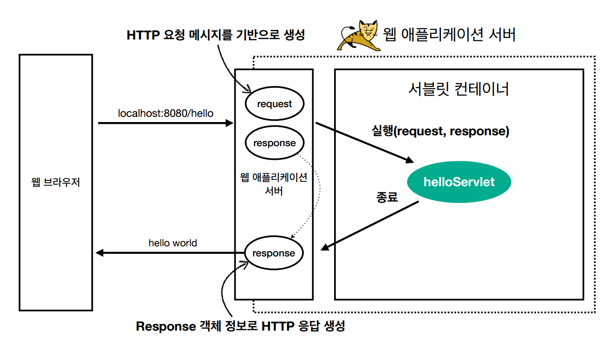

## 웹 서버, WAS

### 웹은 HTTP기반으로 통신을 한다.

- HTTP 메시지를 통해 통신을 한다. 메시지 안에는 다양한 정보가 담길 수 있다.
    - HTML, TEXT
    - 이미지, 음성, 영상, 파일
    - JSON,XML(API)
    - 등등 거의 모든 형태의 데이터 전송이 된다.


### 웹 서버

- HTTP 기반으로 동작한다.
- 정적 리소스, 기타 부가기능
  - 정적 리소스란(파일) HTML, CSS, JS, 이미지, 영상 이런 종류들을 말한다.
- ex) NGINX, APACHE

### WAS(웹 애플리케이션 서버)

- HTTP 기반으로 동작
- 웹 서버 기능 + (정적 리소스 제공 가능)
- 프로그램 코드를 실행해서 애플리케이션 로직이 수행 가능하다.
  - 동적 HTML, HTTP API(JSON)
  - 서블릿, JSP, 스프링 MVC
- ex) 톰캣(Tomcat),Jetty, Undertow


### 그래서 두 개의 차이는?

애플리케이션 코드를 제공한다면 그것은 WAS
> 자바에서는 서블릿 컨테이너 기능을 제공하면 WAS라고 부른다.


### 기본적인 웹 시스템 구성

> 클라이언트 -> WAS -> DB

이런 방식으로 구성이 될 수 있다. 그렇지만 이렇게 하면 WAS가 아까 말했던대로 정적 이미지관련해서도 처리하고 애플리케이션 로직도 처리하고 할 일이 너무 많다.

> 클라이언트 -> Web Server(정적 리소스 담당) -> WAS(애플리케이션 로직) -> DB

그래서 다음과 같이 업무를 분담해서 처리를 하기로 하였다.

### 이렇게 하면 뭐가 좋냐?

- 정적 리소스가 많이 필요? -> Web Server만 증설
- 동적 리소스 많이 필요? -> WAS 증설
- 상대적으로 애플리케이션 로직에서 오류가 많이 나기때문에 오류화면을 앞단인 Web Server에서 앞의 오류 화면을 보여줄 수 있다.

---

## 서블릿?

서블릿이 뭘까? 에 대해서 말하기 전에 보통 어떻게 HTTP 통신이 되는지 간단하게 보자.

```http request
POST /save HTTP/1.1
Host: localhost:8080
Content-Type: application/x-www-form-urlencoded
username=kim&age=20
```

보통 요청을 보내게 되면 다음과 같은 메시지로 가게 된다. 그러면 서블릿을 사용하지 않았을때는 우리가 해야할 일은 다음과 같았다.

- 서버 TCP/IP 연결 대기, 소켓 연결
- HTTP 요청 메시지를 파싱해서 읽기
- POST 방식, /save URL 인지
- Content-Type 확인
- HTTP 메시지 바디 내용 피싱
- username, age 데이터를 사용할 수 있게 파싱
- 저장 프로세스 실행
- 비즈니스 로직 실행
- 데이터베이스에 저장 요청
- HTTP 응답 메시지 생성 시작
- HTTP 시작 라인 생성
- Header 생성
- 메시지 바디에 HTML 생성에서 입력
- TCP/IP에 응답 전달, 소켓 종료

그리고 응답메시지도 다음과 같이 만들어줘야한다. 우리가

```http response
HTTP/1.1 200 OK
Content-Type: text/html;charset=UTF-8
Content-Length: 3423
<html>
 <body>...</body>
</html>
```

딱 봐도 너무 많지만 이걸 요약하면 

### 메시지의 내용 하나하나 분류해서 우리가 다 판단하고 확인해야했다.


그래서 우린 이제 비즈니스 로직에 집중하게 위해서 서블릿이라는 것을 사용하기로 했다. 서블릿을 사용하면 위에 있는 일 중
- 비즈니스 로직 실행
  - 데이터베이스에 저장 요청

이 작업만 해주면 됬던 것이다.

```java

@WebServlet(name = "helloServlet", urlPatterns = "/hello") 
public class HelloServlet extends HttpServlet { 
 @Override 
 protected void service(HttpServletRequest request, HttpServletResponse response){ 
 //애플리케이션 로직
 } 
}
```

그래서 우리가 강의에서 보면 이런 파라미터가 나오는데 `HttpServletRequest`, `HttpServletResponse`

이 객체 안에는 위에 엄청나게 많은 기능들을 다 처리해서 각각의 데이터가 필요할때 꺼내만 오면 될 수 있게 도와주는 역할을 했다. 물론 response도 마찬가지이다.



### 서블릿 컨테이너

- 톰캣처럼 서블릿을 지원하는 WAS를 서블릿 컨테이너라고 한다.
- 서블릿 컨테이너는 서블릿 객체를 생성, 초기화, 호출, 종료하는 생명주기를 관리한다.
- 서블릿 객체는 **싱글톤?**으로 관리한다.
  - 고객의 요청이 올 때마다 계속 객체를 생성하는것은 비효율적이기 때문이다.
  - 최소 로딩 시점에 생성해서 미리 만들고 재활용을 한다.
  - 모든 고객 요청은 동일한 서블릿 객체 인스턴스에 접근한다.
  - 공유 변수 사용을 주의해야한다.
  - 서블릿 컨테이너 종료시 함께 종료된다.
- JSP도 서블릿으로 변환 되어서 사용한다.
- 동시 요청을 위한 멀티 쓰레드 처리를 지원한다.

> 싱글톤 : 인스턴스가 필요할 때, 똑같은 인스턴스를 만들지 않고 기존의 인스턴스를 활용하는 것!


### 출처 
- 스프링 MVC 1편 백엔드 웹 개발 핵심 기술 : https://www.inflearn.com/course/%EC%8A%A4%ED%94%84%EB%A7%81-mvc-1/dashboard
