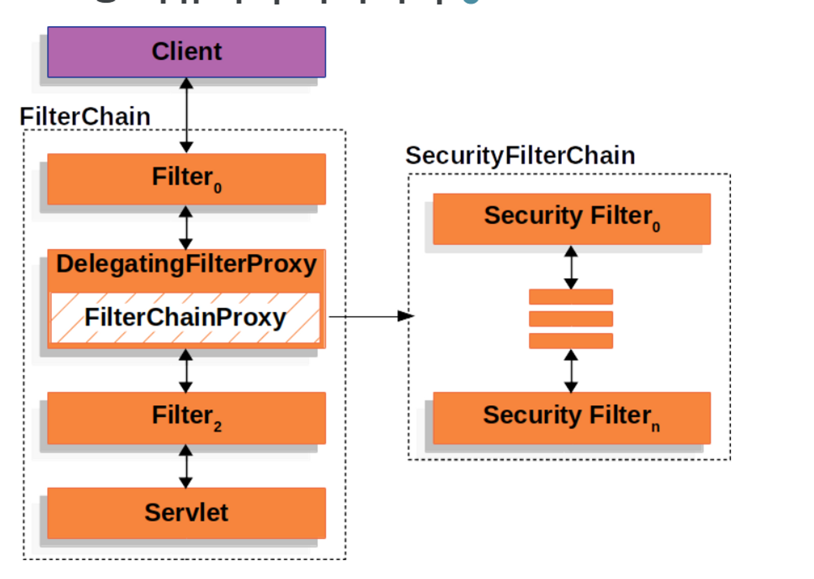

## Spring Security 도입

스프링 요청 처리 과정 이미지를 보면, Tomcat에 `Delegating FilterProxy`라는 것이 있다.

스프링 진영에서 스프링만의 기술인 `Spring Security`를 구현하고 싶었고, 이를 `Dispatcher Servlet`의 앞단에 두고 싶었지만,

톰캣에 이 기능을 직접 삽입하게 되면, 밴더 간 의존성이 매우 커지므로 톰캣에서 이를 위해 `DelegatingFilterProxy`를 추가한 것이다.
Delegating 이라는 단어 뜻에서도 유추할 수 있듯, 작업을 위임하는 필터다.

즉 톰캣 진영인 `Servlet Container`에서 스프링 진영인 `Spring Container`에 위임하는 것이다.

이런 기능을 통해 스프링은 톰캣에 `Spring Security` 라는 Filter를 구현 하여 톰캣 위에서 작동할 수 있도록 설계했다.

그림을 보면 `DelegatingFilterProxy`(톰캣에 존재)가 `SecurityFilterChain`에 작업을 위임하고 있다.

`SecurityFilterChain` 스프링 프레임워크에서 HTTP 요청을 처리하는 방법 중 하나다.
`Spring Security`는 보안과 관련된 필터들을 `Spring Filter Chain`에 추가하고, 이 필터들이 요청의 보안을 처리하도록 구성한다.

**자 이제 Filter의 종류 중 하나인 Spring Security에 대해 자세히 알아보자!!**

 
 

---

## Spring Security

Spring Security는 웹 애플리케이션 보안을 제공하는 Spring Framework의 모듈이다.

인증(authentication)과 권한 부여(authorization)를 포함하여 웹 애플리케이션 보안에 필요한 다양한 기능을 제공한다.

Spring Security가 사용하는 `SecurityFilterChain`은 필터 체인이라는 말 뜻에서 유추할 수 있듯이 필터를 계속 체인처럼 호출한다.

필터들이 SecurityContext에 Authentication 객체가 담길 때 까지 계속해서 `doFilter`를 호출하고, 
마지막에 SecurityContext에 Authentication 객체가 담기지 않았다면 인증이 실패한 것이다.

담겼다면 더 이상 필터 체인이 진행되지 않고, 컨트롤러로 실제 요청이 가게 된다.

> ### 인증과 인가
> 인증 (Authentication)
>- 유저가 누구인지 확인하는 절차, 회원가입하고 로그인 하는 것.
> 
> 인가 (Authorization)
>- 유저에 대한 권한을 파악하는 것

 
 
 

---
자세히 알아보려고 했는데 내용이 너무 어려워서 나중에 스프링 시큐리티 강의 듣게 되면 다시 따로 정리하겠습니다...
이번 주는 스프링 시큐리티 기반 지식을 다진 것으로 만족 >___<

++ 졸작에 스프링 시큐리티가 어떻게 적용 됐는지 나중에 기회가 되면 소개할게요