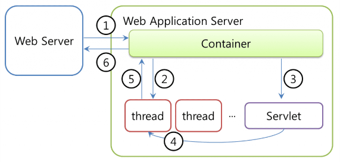
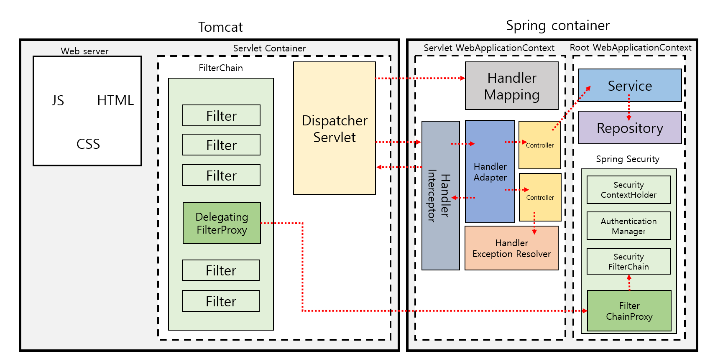

`이 글은 졸작 팀장님의 조언에 기반하여 쓰여졌습니다`

## 웹 서버(WS) vs 웹 애플리케이션 서버(WAS)

### 웹 서버(WS)

- 클라이언트의 요청을 받아 정적 데이터(HTML, Image 등)을 HTTP 프로토콜을 통해 전송
- 클라이언트의 요청이 동적인 데이터를 요구하는 요청이라면 WAS에 처리 요청
- ex) Apache, Nginx 등

### 웹 애플리케이션 서버(WAS)

- 일반적으로 웹 서버의 기능 내재, 웹 서버 없이 WAS 만으로도 서비스가 가능하다.
- 웹 서버에게 받은 요청(동적 데이터 처리)을 처리하여 웹 서버에게 제공한다.
- ex) Tomcat 등

> #### 서블릿이란?
> 동적 웹 페이지를 만들 때 사용되는 자바 기반의 웹 애플리케이션 프로그래밍 기술이다.
> - 클라이언트의 Request에 대해 동적으로 작동하는 웹 어플리케이션 컴포넌트
> - 기존의 정적 웹 프로그램의 문제점을 보완, 동적인 여러 기능 제공
> - JAVA의 스레드를 이용하여 동작
> - MVC 패턴에서 컨트롤러로 이용됨
> - 컨테이너에서 실행
> - 보안 기능 적용 EZ

클라이언트가 웹 서버에 요청을 하면, 웹 서버는 해당 요청을 톰캣과 같은 WAS에 위임한다.
그러면 WAS는 각 요청에 해당하는 서블릿을 실행한다. 그리고 서블릿은 요청에 대한
기능을 수행한 뒤 결과를 반환하여 클라이언트에 전송한다. ...
[출처 1](https://goodgid.github.io/WS-and-WAS/)
[출처 2](https://velog.io/@falling_star3/Tomcat-%EC%84%9C%EB%B8%94%EB%A6%BFServlet%EC%9D%B4%EB%9E%80)

 

## 스프링 요청 처리 과정

###  Tomcat
톰캣은 WAS로써 미들웨어 역할을 하지만, Web Server 역할도 수행 할 수 있다. (위에서 언급했죠?)

메인 기능은 서블릿 컨테이너 역할로, 서블릿의 라이프 사이클을 관리하며 DispatcherServlet도
해당 컨테이너에서 수행된다.

또한, 응답을 위한 소캣을 만드는 역할과 요청마다 스레드를 생성해 요청을 처리하기 위한 스레드풀을 관리한다.

톰캣도 결국 자바 프로그램이기 때문에 별도의 JVM이 동작한다!

### DispatcherServlet

HTTP 프로토콜로 들어오는 모든 요청을 가장 먼저 받아 적합한 컨트롤러에 위임해주는 프론트 컨트롤러다.

톰캣 개념과 엮어 자세히 설명하자면, 클라이언트로부터 어떠한 요청이 오면, 톰캣과 같은 서블릿 컨테이너가
요청을 받는다.

그리고 이 모든 요청을 프론트 컨트롤러인 디스패처 서블릿이 가장 먼저 받게 된다.

그러면 디스패처 서블릿은 공통적인 작업을 먼저 처리한 후에 요청을 처리해야 하는 컨트롤러를 찾아서 작업을 위임한다.

여기서 Front Controller라는 용어가 사용되었는데, 
Front Controller는 주로 서블릿 컨테이너의 제일 앞에서 서버로 들어오는 클라이언트의 모든 요청을 받아서 처리해주는 컨트롤러로써, MVC 구조에서 함께 사용되는 디자인 패턴이다.
... [출처](https://mangkyu.tistory.com/18)

### 스프링 컨테이너 
DispatcherServlet 는 `Servlet WebApplicationContext`와 `Root WebApplicationContext`가 존재한다.

`Root WebApplicationContext`는 Service, datasource,repositories 들을 포함하고 있는 Context이고 
`Servlet WebApplicationContext`는 `RootWebApplicationContext`를 상속받아 구현된 Context로 주로 Controller, Intercepter, ViewResolver, HandlerMapping 등 과 같은 빈들이 존재한다.

Servlet을 구현할때 위처럼 상속관계로 나누어 Servlet WebApplicationContext를 구현한 이유는 서블릿 컨테이너 내부에 여러개의 서블릿이 올 수도 있는데 Service, datasource들은 공통적으로 사용될 수 있기 때문이다.
Container가 Bean 생성 시, Service-Locator 패턴으로 의존성을 주입하며 생성한다.

서블릿의 생명주기를 관리한게 서블릿 컨테이너였다면 스프링 컨테이너는 빈의 라이플 사이클을 관리하며 IOC/DI를 제공해주는 역할을 수행한다.
... [출처](https://gowoonsori.com/spring/architecture/)

### 그래서 중요한 건!!
Tomcat 내부에 Dispatcher Servlet 이라는 애가 Spring Container에 요청을 전달하는 구조 라는 것이다.

 

## Filter와 Interceptor

스프링 시큐리티는 Filter 중 하나라고 볼 수 있다.
