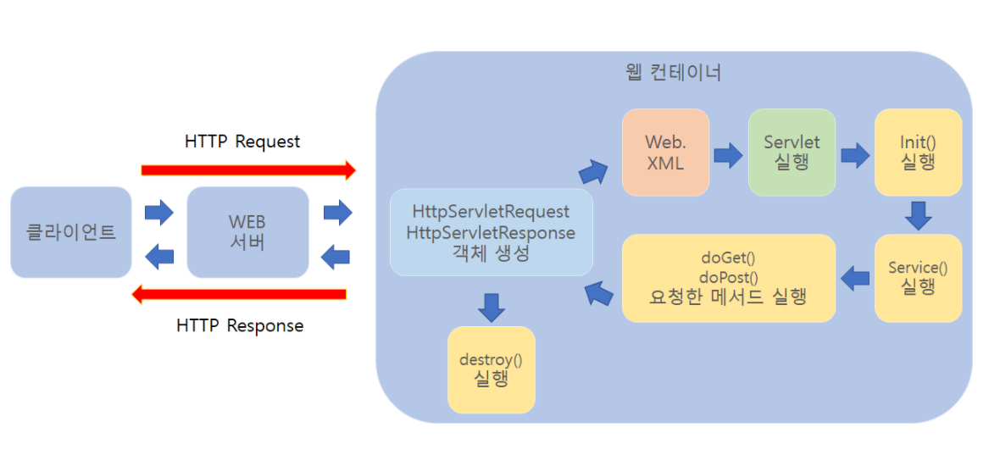
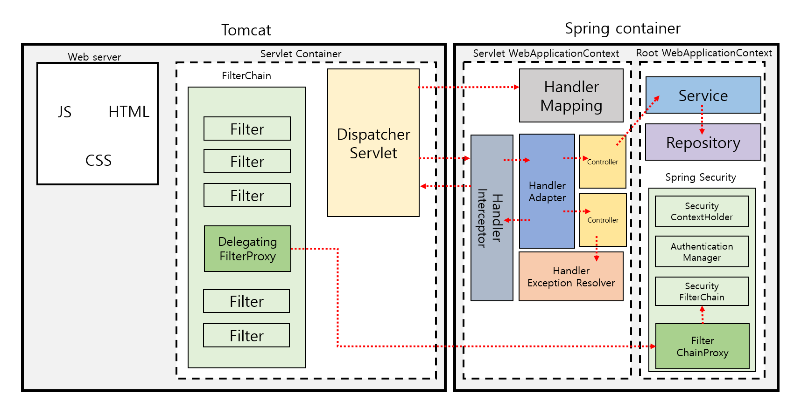
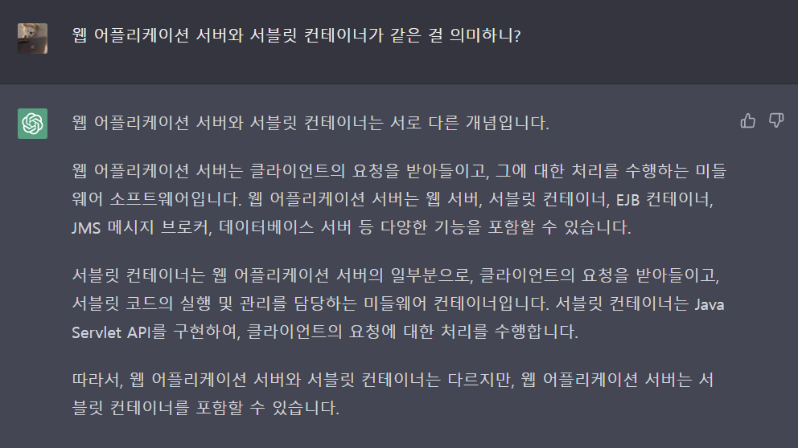
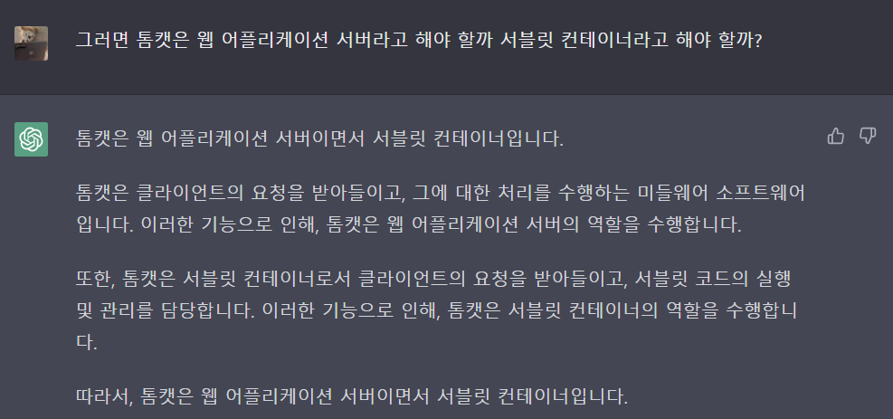
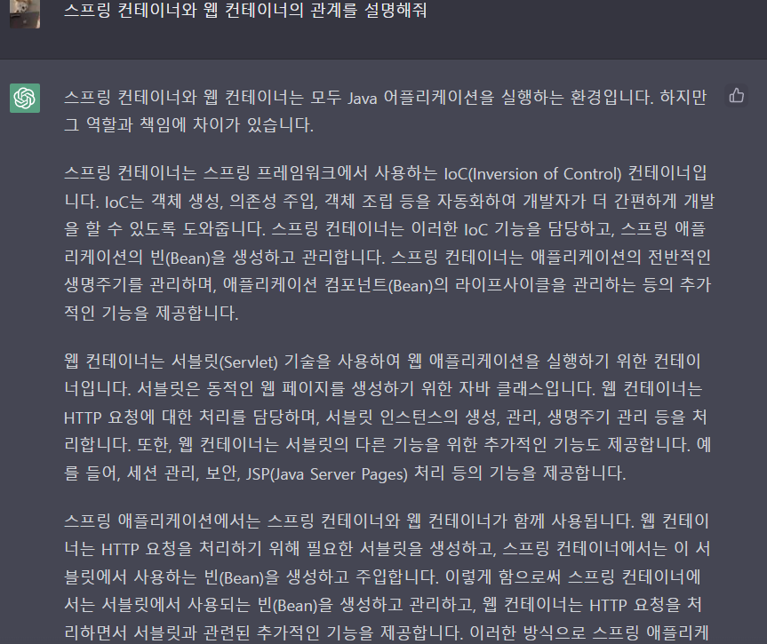
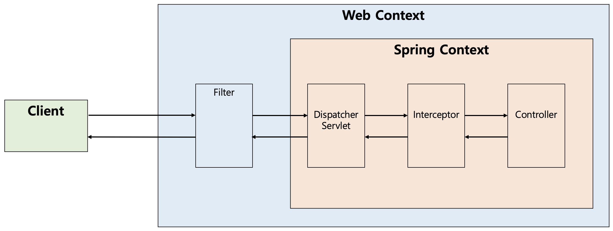

 ## <I> 목차 </I>
 - 웹서버 vs 웹 애플리케이션 서버
   - 웹 서버 (WS)
   - 웹 애플리케이션 서버 (WAS)
 - 스프링 요청 처리 과정
   - Tomcat
   - DispatcherServlet
   - 스프링 컨테이너
 - Filter와 Interceptor
   - Filter
   - Interceptor

 

----

## 웹 서버(WS) vs 웹 애플리케이션 서버(WAS)

### 웹 서버(WS)

- 클라이언트의 요청을 받아 정적 데이터(HTML, Image 등)을 HTTP 프로토콜을 통해 전송한다.
- 클라이언트의 요청이 동적인 데이터를 요구하는 요청이라면, WAS에게 처리를 요청한다.
- ex) Apache, Nginx 등
- 
### 웹 애플리케이션 서버(WAS)

- 웹 서버에게 받은 요청(동적 데이터 처리)을 처리하여 웹 서버에게 제공한다.
- 일반적으로 웹 서버의 기능이 내재되어 있으며, 웹 서버 없이 WAS 만으로도 서비스가 가능하다.
- ex) Tomcat 등

 

! [img_2.png](img/img_2.png)

> #### 서블릿이란?
> 동적 웹 페이지를 만들 때 사용되는 자바 기반의 웹 애플리케이션 프로그래밍 기술이다.
> - 클라이언트의 Request에 대해 동적으로 작동하는 웹 어플리케이션 컴포넌트
> - 기존의 정적 웹 프로그램의 문제점을 보완, 동적인 여러 기능 제공
> - JAVA의 스레드를 이용하여 동작
> - MVC 패턴에서 컨트롤러로 이용됨
> - 컨테이너에서 실행
> - 보안 기능 적용 EZ

클라이언트가 웹 서버에 요청을 하면, 웹 서버는 해당 요청을 톰캣과 같은 WAS에 위임한다.

그러면 WAS는 각 요청에 해당하는 서블릿을 실행한다. 

그리고 서블릿은 요청에 대한 기능을 수행한 뒤, 결과를 반환하여 클라이언트에 전송한다. 
...
[출처 1](https://goodgid.github.io/WS-and-WAS/)
[출처 2](https://velog.io/@falling_star3/Tomcat-%EC%84%9C%EB%B8%94%EB%A6%BFServlet%EC%9D%B4%EB%9E%80)

 
 

---

## 스프링 요청 처리 과정

###  Tomcat
톰캣은 `WAS`로써 미들웨어 역할을 하지만, Web Server 역할도 수행 할 수 있다. (위에서 언급했죠?)

메인 기능은 `서블릿 컨테이너` 역할로, 서블릿의 라이프 사이클을 관리하며 `DispatcherServlet`도 해당 컨테이너에서 수행된다.

또한, 응답을 위한 소캣을 만드는 역할, 요청마다 스레드를 생성하여 요청을 처리하기 위한 스레드풀을 관리하는 역할을 한다.
톰캣도 결국 자바 프로그램이기 때문에 별도의 JVM이 동작한다!

> Tomcat을 WAS의 일종으로 알고 있었지만, 서블릿 컨테이너라 칭하는 경우도 있어, 이러한 경우에 대해 chat GPT 에게 물어봤다.
>
> 
> 

 

### DispatcherServlet

HTTP 프로토콜로 들어오는 모든 요청을 가장 먼저 받아 적합한 컨트롤러에 위임해주는 `프론트 컨트롤러`다.

톰캣 개념과 엮어 자세히 설명하자면, 클라이언트로부터 어떠한 요청이 오면, 톰캣과 같은 서블릿 컨테이너가
요청을 받는다.

그리고 이 모든 요청을 프론트 컨트롤러인 `DispatcherServlet`이 가장 먼저 받게 된다.

그러면 `DispatcherServlet`은 공통적인 작업을 먼저 처리한 후에 요청을 처리해야 하는 컨트롤러를 찾아서 작업을 위임한다.

여기서 `Front Controller`라는 용어가 사용되었는데, 
`Front Controller`는 주로 서블릿 컨테이너의 제일 앞에서 서버로 들어오는 클라이언트의 모든 요청을 받아서 처리해주는 컨트롤러로써, MVC 구조에서 함께 사용되는 디자인 패턴이다.
... [출처](https://mangkyu.tistory.com/18)

 

### 스프링 컨테이너 

스프링 컨테이너는 스프링 프레임워크의 핵심 컴포넌트 중 하나로, 스프링 어플리케이션의 객체를 생성하고 관리하는 역할을 한다.

스프링 어플리케이션에서는 객체 간의 의존성 관리가 필요한데, 스프링 컨테이너는 이러한 의존성을 관리해준다. 

즉, 스프링 컨테이너는 스프링 어플리케이션에서 필요한 객체를 생성하고, 이러한 객체 간의 의존성을 자동으로 연결해 주는 것이다.

[//]: # (스프링 컨테이너는 두 가지 주요한 유형이 있다. )
[//]: # (첫 번째는 `BeanFactory`이며, 이는 스프링 어플리케이션에서 사용되는 모든 빈을 생성하고 관리한다. )
[//]: # (두 번째는 `ApplicationContext`이며, 이는 `BeanFactory`를 확장한 것으로, 더 다양한 기능과 편의성을 제공한다. )
[//]: # (`ApplicationContext`는 스프링의 기능을 활용하여 외부 설정 파일, 데이터베이스, 웹 서비스 등 다양한 자원을 쉽게 가져올 수 있으며, 스프링 보안, 캐시, 이벤트 처리 등 다양한 기능을 제공한다.)
[//]: # (이와 같이 스프링 컨테이너는 스프링 어플리케이션에서 객체 생성과 의존성 관리를 자동으로 처리하여 개발자의 작업을 편리하게 해주는 중요한 역할을 한다.)

<U>서블릿의 생명주기를 관리한게 서블릿 컨테이너였다면, 스프링 컨테이너는 빈의 라이플 사이클을 관리하며 IOC/DI를 제공해주는 역할을 수행한다. </U>

 

... 출처 : chat GPT

 

### 그래서 중요한 건!!
Tomcat 내부에 Dispatcher Servlet 이라는 애가 Spring Container에 요청을 전달하는 구조 라는 것이다.

 
 

---

## Filter와 Interceptor

### 필터

필터(Filter)는 J2EE 표준 스펙 기능으로 디스패처 서블릿(Dispatcher Servlet)에 요청이 전달되기 전/후에
url 패턴에 맞는 모든 요청에 대해 부가 작업을 처리할 수 있는 기능을 제공한다.

디스패처 서블릿은 스프링의 가장 앞단에 존재하는 프론트 컨트롤러이므로, 필터는 스프링 범위 밖에서 처리가 되는 것이다.

즉, 스프링 컨테이너가 아닌 톰캣과 같은 웹 컨테이너에 의해 관리가 되는 것이고, 디스패처 서블릿 전/후에 처리한다.
(이후 스프링 빈으로 등록은 된다.)

### 인터셉터

인터셉터는 J2EE 표준 스펙인 필터(Filter)와 달리 Spring이 제공하는 기술로, 디스패처 서블릿(Dispatcher Servlet)이
컨트롤러를 호출하기 전과 후에 요청과 응답을 참조하거나 가공할 수 있는 기능을 제공한다.

즉, 웹 컨테이너에서 동작하는 필터와 달리 인터셉터는 스프링 컨텍스트에서 동작을 하는 것이다.

 
 

`이 글은 Raccoon 팀장님의 정리에 기반하여 쓰여졌습니다`