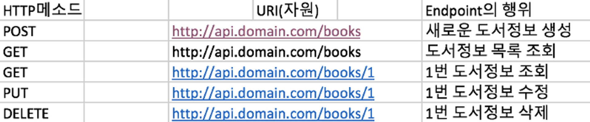
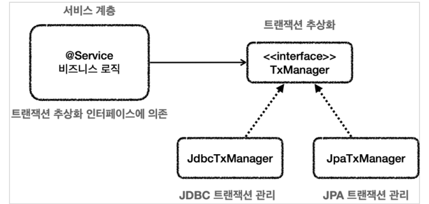

[//]: # (- SOLID 좋은 객체 지향 설계)
[//]: # (- Spring이 나오게 된 이유)


## DI, IOC, Spring Bean

### DI : Dependency Injection (의존성 주입)

- 외부에서 두 객체 간의 관계를 결정해주는 디자인 패턴이다.
- 인터페이스를 사이에 둠으로써, 클래스 레벨에서는 의존관계가 고정되지 않도록 하여, 런타임 시에 관계를 동적으로 주입한다.

`public Store() { this.pencil = new Pencil() }`을 보면, Store 클래스와 Pencil 클래스가 강하게 결합되어 있다.

Pencil, Food 등 여러 제품을 하나로 표현하기 위한 Product라는 인터페이스 및,
해당 인터페이스의 구현체 Pencil을 선언해보자. 

`public interface Product { }`
`public class Pencil implements Product { }`

그럼 다음과 같은 코드 작성이 가능해진다.

``` 
public class Store {

    private Product product;

    public Store(Product product) {
        this.product = product;
    }

} 
```
위 코드를 보면 외부에서 상품을 "주입" 받고 있다. Store이 구체 클래스를 의존하지 않기 위함이다.

이러한 이유로 Spring이라는 DI 컨테이너를 필요로 한다.

Store에서 Product 객체를 주입하기 위해서는 어플리케이션 실행 시점에 
필요한 객체(빈) 을 생성해야 하며, 의존성이 있는 두 객체를 연결하기 위해 한 객체를 다른 객체로 주입시켜야 한다.

- 두 객체의 관계라는 관심사 분리
- 두 객체 간의 결합도를 낮춤
- 객체의 유연성을 높임
- 테스트 작성을 용이하게 함

<br>

### IOC : Inversion of Control (제어의 역전)

-  프로그램의 흐름을 개발자가 관리하는 것이 아닌, 외부에 맡긴다는 뜻이다.

<br>

### 스프링 빈과 빈 컨테이너
스프링은 실행시 빈 컨테이너(Bean Factory 또는 ApplicationContext)를 만든다.
이때 componentScan 같은 과정을 거쳐서 자바의 객체들을 빈으로 등록하게 된다.

그럼, 빈으로 등록하는 이유는 무엇일까? 

DI, IOC 개념과 연결된다.

런타임 시 빈컨테이너에 빈(자바 객체)들이 등록되어 있고,
프로그래머가 작성한 코드에서 특정 객체를 필요로 한다면, 스프링 프레임워크가 해당 객체(빈)을 알아서 주입해준다!

개발자는 직접 new classB() 같은 것들을 호출할 필요가 없어지는 것이다.

빈을 주입하는 방식은 생성자 주입, Setter 주입, 필드 주입 등 다양하지만, 스프링에서는 생성자 주입을 권장한다!

- 스프링 빈으로 등록된 객체는 applicationContext(main에 붙어있음)라는 빈 컨테이너에 등록되어, 런타임시 필요로 하는 곳에 의존성을 주입해준다.
- 더불어, 런타임시 필요로 하는 곳에 자바 객체를 주입해 준다.

<br>

출처 : https://mangkyu.tistory.com/150

---
## REST API
Representational State Transfer 의 약자로, 직역하자면 `대표 상태 전송` 이다.

### API
ApplicationProgramming Interface, 응용 프로그램에서 사용할 수 있도록 운영 체제나 프로그래밍 언어가 제공하는 기능을 제어할 수 있게 만든
인터페이스를 뜻한다.


### REST의 4가지 속성
1. 서버에 있는 모든 resource는 각 클라이언트가 바로 접근할 수 있는 고유의 URL이 존재한다.
2. 모든 요청은 클라이언트가 요청할 때마다 필요한 정보를 주기 때문에 서버에서는 세션 정보를 보관할 필요가 없습니다. 
   그렇기 때문에 서비스에 자유도가 높아지고 유연한 아키텍쳐 적응이 가능하다.
3. HTTP 메소드를 사용한다는 점. 모든 resource는 일반적으로 HTTP 인터페이스인 GET, POST, PUT, DELETE 4개의 메소드로 접근되어야 한다.
4. 서비스 내에 하나의 resource 가 주변에 연관된 리소스들과 연결되어 표현이 되어야 한다.


### 즉! 
REST API는 REST를 통해서 서비스 API를 구현한 것을 말한다.


### EndPoint
메소드 같은 URL들에 대해서도 다른 요청을 하게끔 구별하게 해주는 항목이 바로 EndPoint이다.



각각 GET, PUT, DELETE 메소드에 따라 다른 요청을 하는 것을 알 수 있다.
결국, EndPoint란 API가 서버에서 자원(resource)에 접근할 수 있도록 하는 URL이다.

<br>

출처 : https://velog.io/@kho5420/Web-API-%EA%B7%B8%EB%A6%AC%EA%B3%A0-EndPoint

---
## 트랜잭션
데이터베이스 관리 시스템 또는 유사한 시스템에서 상호작용의 단위이다.
여기서 유사한 시스템이란 트랜잭션이 성공과 실패가 분명하고 상호 독립적이며,
일관되고 믿을 수 있는 시스템을 의미한다.

- 오류로부터 복구를 허용하고, 데이터베이스를 일관성 있게 유지하는 안정적인 작업 단위를 제공
- 동시에 접근하는 여러 프로그램 간 격리를 제공

### ACID
이론적으로 데이터베이스 시스템은 각각의 트랜잭션에 대해 원자성(Atomicity),
일관성(Consistency), 독립성(Isolation), 영구성(Durability)을 보장한다.
이 4가지를 묶어 ACID라 부른다.


### 트랜젝션 과정
1. 트랜젝션 시작
2. 비즈니스 로직 실행(여러 쿼리들이 실행, DB 갱신은 아직)
3. 트랜잭션 커밋(트랜잭션이 성공적이며, 갱신이 실제 적용됨)

<br>

## 스프링 트랜잭션
### 트랜잭션 동기화
- DB와 연결된 `Connection` 오브젝트를 `특별한 저장소`에 보관
- 이후, `DAO`의 메소드에서 `트랜잭션`이 필요할 때
- 저장된 `Connection`을 가져다가 사용한다.

>  TranscationSynchronizationManger
> - 트랜잭션 동기화 저장소
> - 작업 스레드마다 독립적으로 Connection 오브젝트를 저장하고 관리
> - 다중 사용자를 처리하는 서버의 멀티스레드 환경에서도 충돌 x

동기화를 통해 , 여러 쿼리를 한 로컬 트랜잭션에서 관리 가능,  파라미터도 제거 가능!


### 트랜잭션 추상화



스프링은 Data 접근 기술에 독립적인 트랜잭션을 사용 할 수 있다.
기술 별로 가져오는 트랜잭션 형태만 다를 뿐, 트랜잭션 기능은 같기 때문에 추상화가 가능하다.
- PlatformTransactionManager
- 기술에 독립적이다
- 트랜잭션 경계 설정이 가능해진다.


### <u>@Transactional (선언적 트랜잭션)</u>
(여기서부터 추가 예정,, )

출처 : https://velog.io/@betterfuture4/Spring-Transactional-%EC%B4%9D%EC%A0%95%EB%A6%AC

---
## 엔티티와 DTO


[//]: # (## RestControllerAdvice)

[//]: # (https://mangkyu.tistory.com/204)

[//]: # (https://mangkyu.tistory.com/205)

[//]: # (---)

[//]: # (## 컨트롤러에서 사용자가 보낸 HTTP 내 값 받기)

[//]: # (일단은 @RequestBody & @RequestParam)


