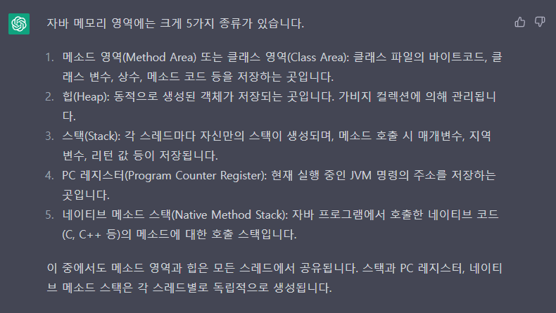

- 저번 발표 하면서 생긴 미션
## Static, Fianl을 언제 쓰는가

## Static
자바에서 `static` 키워드는 언제 사용해야 할까? 간단하게는 `여러 객체에서 한 가지 값을 사용할 때` 사용하면 된다.

구체적으로는 다음과 같다.

> 1. `정적 변수(Static variable)`: 클래스 변수 또는 정적 필드로 불린다.
클래스의 모든 인스턴스들이 공유할 수 있는 변수로, 클래스가 로딩될 때 생성되고,
프로그램 종료 시까지 존재한다.
> 
> 2. `정적 메소드(Static method)`: 클래스 메소드 또는 정적 메소드로 불린다.
인스턴스에 종속되지 않는 메소드로, 객체를 생성하지 않고도 클래스 이름을 통해 호출할 수 있다.
> 
> 3. `정적 블록(static block)`: 클래스가 로딩될 때 실행되는 블록으로,
주로 클래스 변수의 초기화나 클래스에 필요한 리소스를 로딩하는 작업 등을 수행한다.
>
> 4. `중첩 클래스(static nested class)`: 클래스 내부에 선언된 클래스로, 외부 클래스의
인스턴스와 독립적으로 존재한다. 중첩 클래스를 `static`으로 선언하면,
외부 클래스의 인스턴스와 독립적으로 사용할 수 있다.

static 키워드가 붙은 정적 변수, 정적 메소드, 정적 블록은 자바의 클래스 영역(=메소드 영역)에 존재한다.
클래스 영역은 JVM이 클래스를 처음 읽어들일 때 생성되며, 모든 클래스 변수와 클래스 메소드, 상수, static 블록 등을
저장하는 영역이다.




Static 메모리 영역에 저장되어 고정된 메모리 영역을 사용하기 때문에
매번 인스턴스를 생성하며 낭비되는 메모리를 줄일 수 있다.
객체를 생성하지 않고 사용 가능하기 때문에 속도가 빠르다는 장점도 있다.
클래스가 메모리에 올라가는 시점에 생성되어 바로 사용이 가능하기 때문에 속도 면에서 이점을 가진다.

이렇게만 보면 Static 키워드를 쓰는게 매우 좋아보인다.

그러나 static 키워드를 사용하게 되면 프로그램 시작붙 종료 시까지 메모리에 할당된 채로 존재하기 때문에
프로그램 퍼포먼스에 악영향을 줄 수 있다. 또한, static을 사용한다는 것 자체가 캡슐화에 위반한다. 
Interface를 구현하는 데도 사용할 수 없어, 객체지향적인 설계를 막는다. 
때문에 Static 키워드는 반드시 필요한 상황에서만 사용해야 한다.

출처: https://velog.io/@gudonghee2000/static-vs-%EC%8B%B1%EA%B8%80%ED%86%A4-%ED%8C%A8%ED%84%B4


<br>

## Final

1. 변수에 적용
```java
final int MAX_VALUE = 100;
```
final을 붙인 변수는 값을 변경할 수 없는 상수가 된다.
이는 변수가 선언 될 때 초기화 되어야 하며, 이후에는 변경할 수 없다.

2. 메소드에 적용
```java
public final void pringMessage(){
    System.out.println("Hello, world!");
        }
```
final 키워드를 메소드 선언 앞에 붙이면 해당 메소드는 하위 클래스에서 오버라이딩을 할 수 없다.

3. 클래스에 적용
```java
public final class MyFinalClass{
    //...
}
```
final 키워드를 클래스 선언 앞에 붙이면 해당 클래스는 하위 클래스를 가질 수 없다.
즉, 상속이 불가능한 클래스가 된다.

<br>

---

## GET과 POST의 차이

---
(졸작하면서 생긴 미션)

## 정적 펙토리 메서드

---
## 람다식, 자바 컬렉션, 제네릭

---
## DTO의 필요성