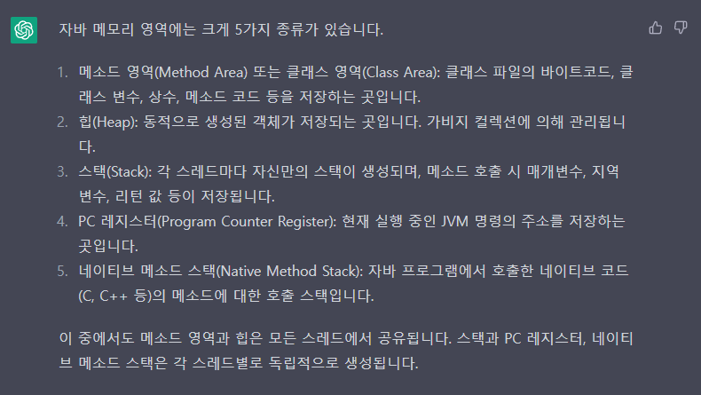
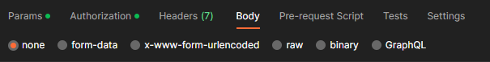
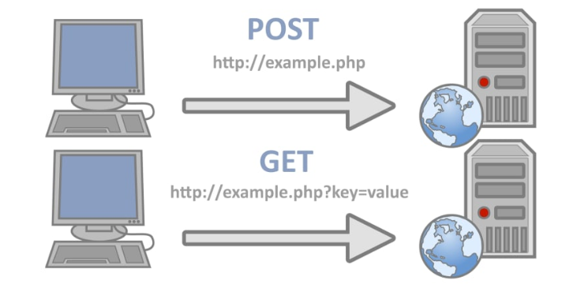

## Static, Fianl을 언제 쓰는가

## Static
자바에서 `static` 키워드는 언제 사용해야 할까? 간단하게는 `여러 객체에서 한 가지 값을 사용할 때` 사용하면 된다.

구체적으로는 다음과 같다.

> 1. `정적 변수(Static variable)`: 클래스 변수 또는 정적 필드로 불린다.
클래스의 모든 인스턴스들이 공유할 수 있는 변수로, 클래스가 로딩될 때 생성되고,
프로그램 종료 시까지 존재한다.
> 
> 2. `정적 메소드(Static method)`: 클래스 메소드 또는 정적 메소드로 불린다.
인스턴스에 종속되지 않는 메소드로, 객체를 생성하지 않고도 클래스 이름을 통해 호출할 수 있다.
> 
> 3. `정적 블록(static block)`: 클래스가 로딩될 때 실행되는 블록으로,
주로 클래스 변수의 초기화나 클래스에 필요한 리소스를 로딩하는 작업 등을 수행한다.
>
> 4. `중첩 클래스(static nested class)`: 클래스 내부에 선언된 클래스로, 외부 클래스의
인스턴스와 독립적으로 존재한다. 중첩 클래스를 static으로 선언하면,
외부 클래스의 인스턴스와 독립적으로 사용할 수 있다.

static 키워드가 붙은 정적 변수, 정적 메소드, 정적 블록은 자바의 클래스 영역(=메소드 영역)에 존재한다.
클래스 영역은 JVM이 클래스를 처음 읽어들일 때 생성되며, 모든 클래스 변수와 클래스 메소드, 상수, static 블록 등을
저장하는 영역이다.




Static 메모리 영역에 저장되어 고정된 메모리 영역을 사용하기 때문에
매번 인스턴스를 생성하며 낭비되는 메모리를 줄일 수 있다.
객체를 생성하지 않고 사용 가능하기 때문에 속도가 빠르다는 장점도 있다.
클래스가 메모리에 올라가는 시점에 생성되어 바로 사용이 가능하기 때문에 속도 면에서 이점을 가진다.

이렇게만 보면 Static 키워드를 쓰는게 매우 좋아보인다.

그러나 static 키워드를 사용하게 되면 프로그램 시작붙 종료 시까지 메모리에 할당된 채로 존재하기 때문에
프로그램 퍼포먼스에 악영향을 줄 수 있다. 또한, static을 사용한다는 것 자체가 캡슐화에 위반한다. 
Interface를 구현하는 데도 사용할 수 없어, 객체지향적인 설계를 막는다. 
때문에 Static 키워드는 반드시 필요한 상황에서만 사용해야 한다.

<br>

## Final

1. 변수에 적용
```java
final int MAX_VALUE = 100;
```
final을 붙인 변수는 값을 변경할 수 없는 상수가 된다.
이는 변수가 선언 될 때 초기화 되어야 하며, 이후에는 변경할 수 없다.

2. 메소드에 적용
```java
public final void pringMessage(){
    System.out.println("Hello, world!");
        }
```
final 키워드를 메소드 선언 앞에 붙이면 해당 메소드는 하위 클래스에서 오버라이딩을 할 수 없다.

3. 클래스에 적용
```java
public final class MyFinalClass{
    //...
}
```
final 키워드를 클래스 선언 앞에 붙이면 해당 클래스는 하위 클래스를 가질 수 없다.
즉, 상속이 불가능한 클래스가 된다.

<br>

출처: https://velog.io/@gudonghee2000/static-vs-%EC%8B%B1%EA%B8%80%ED%86%A4-%ED%8C%A8%ED%84%B4

<br>


---

## GET과 POST의 차이점

### GET
> 클라이언트에서 서버로 어떠한 리소스로부터 정보를 요청하기 위해 사용되는 메서드.

= 데이터를 읽거나, 검색할 때 사용된다.

GET은 요청을 전송할 때 URL 주소 끝에 파라미터로 내용을 담아 보낸다.

```http request
http://localhost:3000/login?id=admin&pw=1234
```

때문에 **민감한 요청을 다룰 때는 GET을 사용해서는 안된다.(보안)**

데이터 조회의 경우에는 전송되는 데이터 양이 크고 변경될 일이 적기 때문에 불필요한 요청을 줄이기 위해
요청이 **캐시**될 수 있다. 

또한 **브라우저에 기록**이 남고, 요청 데이터에 길이가 제한된다는 특징이 있다.

GET 요청은 성공시, 200(Ok) HTTP 응답 코드를 XML, JSON 뿐만 아니라 여러 데이터,
여러 형식의 데이터와 함께 반환된다.

<br>

### POST
> 리소스를 생성/업데이트 하기 위해 서버에 데이터를 보내는 데 사용되는 메서드.

`GET`과 달리, 전송해야 할 데이터를 HTTP 메세지의 Body에 담아서 전송한다. 

```http request
http://localhost:3000/login
```

해당 Body 타입은 요청 헤더에서 Content-Type에 요청 데이터의 타입을 표시하여 결정할 수 있다.



`POST`는 데이터가 Body로 전송되고, 내용이 눈에 보이지 않아 `GET`보다 보안적으로 안전하다고 생각할 수 있지만,
`POST` 요청도 크롬의 개발자 도구, Fiddler과 같은 툴로 요청 내용을 확인할 수 있기 때문에,
민감한 데이터의 경우에는 반드시 암호화 해서 전송해야 한다.

POST는 GET과 달리 캐시되지 않으며, 브라우저 기록이 남지 않는다.

HTTP Body를 통해 데이터를 전송하기 때문에 길이 제한이 없고, 대용량 데이터 전송이 가능하다.

<br>

### 가장 중요한 차이점은?!

캐시, 브라우저 히스토리, 데이터의 길이 관련된 차이도 있지만, 

GET과 POST의 가장 중요한 차이점은 **`GET`은 Idempotent, `POST`는 Non-idempotent 하다** 는 것이다.

idempotent는 직역하면 **멱등**이라 하며, 멱등은
`연산을 여러 번 적용해도 결과가 달라지지 않는 성질`을 뜻한다.

즉, 멱등하다는 것은!! 동일한 연산을 여러 번 수행하더라도 동일한 결과가 나타난다는 뜻이다.



`GET`은 멱등하지만, `POST`는 멱등하지 않다.


<br>

출처 : https://velog.io/@songyouhyun/Get%EA%B3%BC-Post%EC%9D%98-%EC%B0%A8%EC%9D%B4%EB%A5%BC-%EC%95%84%EC%8B%9C%EB%82%98%EC%9A%94

<br>
