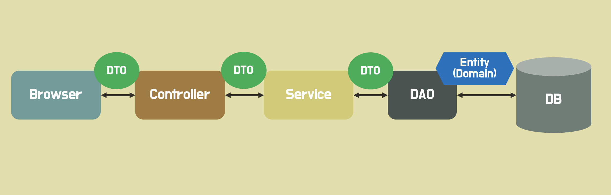

## DTO의 필요성

### 🧐 공부하게 된 계기
졸작에서 간단한 CRUD 작업을 하게 되었다. 
그러나 API를 만들어 본 경험이 없기 때문에, 팀장님이 짠 코드를 보고 비슷하게 짜야 하는 상황이었다.
팀장님 코드를 봤을 때, 어떤 곳에서는 DTO를 만들어서 요청받거나 반환하고 있었고, 어떤 곳에서는 DTO를 사용하지 않고 있었다.
그래서 어떤 상황에서 DTO를 만들어 사용해야 하는지 알기 위해 공부하게 되었다.

### ✔️ DTO란

> Data Transfer Object의 약자로, 계층 간 데이터 전송을 위해 도메인 모델 대신 사용되는 객체다.



DTO는 순수하게 데이터를 저장하고, 데이터에 대한 getter, setter 만을 가져야 한다.

DTO는 어떠한 비즈니스 로직도 가져선 안되며, 저장, 검색, 직력화, 역직렬화 로직만을 가져야 한다.

### ✔️ DTO의 필요성

#### 1.DTO를 사용하지 않을 경우 엔티티의 변경에 의해 API 스펙이 변경될 수 있다.
   
> - 엔티티와 API가 일대일 대응 관계를 가진다면, 엔티티에 수정이 일어날 때마다 API 스펙을 일일히 변경해주어야 한다.
> - 이는 매우 번거로운 작업이며, 컴파일 에러로 감지할 수도 없어 에러 원인을 찾기가 어렵다.
> - DTO를 사용하면 DTO->엔티티 과정에서 컴파일 에러가 발생한다.

#### 2.하나의 엔티티에 대해서는 API가 여러개 존재할 수 있다.
> - 각각의 API가 요구하는 엔티티에 대한 데이터는 모두 다를 확률이 높다. 
> - 이 때, 그냥 엔티티의 모든 정보를 넘겨줘버리면 필요없는 데이터까지 받긴 하지만, 기능 동작에는 문제가 없다. 
> - 그러나 PW 처럼 보안상 감추어야 할 정보까지 모두 JSON으로 함께 넘어가기 때문에, 보안 문제가 발생할 수 있다.
> - 엔티티 측에서 컬럼에 @JsonIgnore를 사용해 JSON 전달을 막을 수는 있지만, 이는 엔티티가 API 스펙에 의존성을 갖게 되므로 좋지 않다.

#### 3.엔티티를 그대로 넘겨줄 경우, 엔티티가 가진 정보 외의 것들은 넘겨주지 못한다.
> - DTO를 사용하면 엔티티의 정보 외에 추가적으로 필요한 정보도 함께 넘겨줄 수 있다.

### ✔️ 예시 (프로젝트 코드)

```java
@Entity
@Table(name = "story")
@Getter
@NoArgsConstructor(access = AccessLevel.PROTECTED)
public class Story {

    @JsonIgnore
    @Id
    @GeneratedValue(strategy = GenerationType.IDENTITY)
    @Column(name = "story_id")
    private Long id;

    @ManyToOne(fetch = FetchType.LAZY)
    @JoinColumn(name = "user_profile_id", nullable = false)
    private UserProfile userProfile;

    @Column(name = "contents", nullable = false, length = 500)
    private String contents;

    @Column(name = "like_count")
    private Long likeCount;

    @Column(name = "story_image")
    private String storyImageUrl;
    
    //...

    public void updateStory(StoryUpdateDto storyUpdateDto, String storyImageUrl){
        if(storyUpdateDto.getContents() != null )this.contents=storyUpdateDto.getContents();
        if(storyUpdateDto.getStoryImage() != null )this.storyImageUrl=storyImageUrl;
    }
}
```
```java
@Data
@AllArgsConstructor(staticName="of")
public class StoryUpdateDto {
    private Long storyId;
    private String contents;
    private MultipartFile storyImage;
}
```
<br>

출처 
- https://hudi.blog/data-transfer-object/
- https://codeung.tistory.com/319
 
[//]: # (- ![img_4.png]&#40;img_4.png&#41;)
<br>
