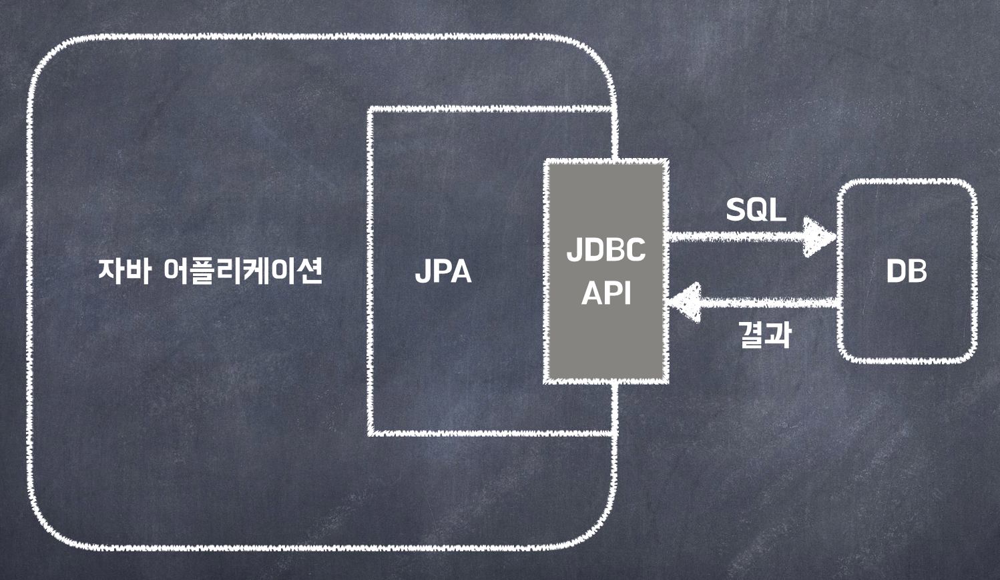

_Q. JPA & Query DSL vs MyBatis_

_A. 기본적인 쿼리(CRUD)는 jpa로 짜고, 동적 쿼리는 mybatis 처리를 한다._

# JPA

## JPA란 무엇인가?

- JPA는 `Java Persistence API`의 약자다.
- Java 진영에서 `ORM(Object-Relational Mapping) 기술 표준`으로 사용하는 인터페이스 모음
- 자바 어플리케이션에서 `관계형 데이터 베이스`를 사용하는 방식을 정의한 인터페이스
- 어플리케이션과 JDBC(Java Database Connectivity) 사이에서 동작한다.
- 인터페이스이기 때문에 Hibernate, OpenJPA 등이 JPA를 구현한다.



<br>

## ORM 

우리가 일반적으로 알고 있는 애플리케이션 Class와 RDB(Relational DataBase)의 테이블을 매핑(연결)한다는 뜻이며,
기술적으로는 어플리케이션의 `객체를 RDB 테이블에 자동으로 영속화 해주는 것`이라고 보면 된다.

- ORM(Object Relational Mapping)은 `객체-관계-매핑` 의 약자다.
- 객체와 테이블을 매핑해서 `패러다임의 불일치`를 개발자 대신 해결해준다.


> #### 패러다임의 불일치란?
> 데이터베이스는 데이터를 중심으로 구조화 되어있고, 객체의 상속과 다형성 같은 개념이 없다.
> 
> 그러다보니, 객체와 데이터베이스가 지향하는 점이 다르다. 이것을 객체와 데이터베이스의 **패러다임 불일치**라 한다.

> #### 예시 
> JAVA에서는 부모클래스와 자식클래스의 관게, 즉 **상속 관계**가 존재한다.
> Class에서 또 다른 Class Type을 필드 변수로 가지고 있는 **연관관계**라는 것도 있다.
> 데이터베이스에서는 이러한 객체의 상속 관계 및 연관관계를 표현하려면 복잡한 쿼리문이 필요하다.
> 
> **JPA는 상속 관계 및 연관 관계를 자동으로 주입해준다.** 매우 편하게 !!!
> 
> 자세한 사용법은 JPA 문법을 참고하자.

<br>

## 왜 JPA를 사용해야 할까?

1. JPA는 반복적인 CRUD SQL을 처리해준다. 매우 편리하다.

2. JPA는 매핑된 관계를 이용해서 SQL을 생성하고 실행하는데,
개발자는 어떤 SQL이 실행될지 생각만하면 되고, 예측도 쉽게 할 수 있다. 

3. 추가적으로 JPA는 `네이티브 SQL`이란 기능을 제공해주는데
관계 매핑이 어렵거나 성능에 대한 이슈가 우려되는 경우 SQL을 직접 작성하여 사용할 수도 있다.

- 가장 큰 장점은 SQL이 아닌 `객체 중심`으로 개발할 수 있다는 것
- 앞서 말한 `패러다임의 불일치를 해결`해 준다는 것


> 추가적으로, 스프링에서 흔히 사용하는 JPA는 JPA을 이용하는 **spring-data-jpa 프레임워크**지, JPA는 아니다.
> JPA는 단순한 명세일 뿐, JPA만 가지고는 어떤 구현 기술도 사용할 수 없다.
> 
> Spring Data JPA는 JPA를 간편하게 사용하도록 만들어놓은 오픈 소스일 뿐이다. 
>
> 이와 비슷한 기술로 Spring Data JPA, Spring Data Redis, Spring Data MongoDB 등과 같은 다양한 라이브러리가 존재 한다. 
>
> 그리고 JPA를 사용하다 보면 Hibernate를 많이 사용하게 되는데 Hibernate는 JPA의 구현체라고 할 수 있다


<br>

# JPQL

### ORM의 목적
  - DB 테이블이 아닌, 엔티티 객체를 대상으로 개발하기 위함.

### JPQL이란?
  - Java Persistence Query Language
  - 위와 같은 ORM의 목적처럼, `엔티티 객체를 대상으로 데이터를 검색하기 위한` 객체지향 쿼리이다.
  - `보다 복잡한 쿼리를 위해` JPA에서 제공하는 기능

### SQL vs JPQL
  - **SQL**
    - DB 테이블을 대상으로 하는 `데이터 중심의 쿼리`
    - SQL은 데이터베이스에 종속적이다.
    - SQL은 `테이블을 대상`으로 쿼리를 작성한다.
    - 문자열로 작성되며, 컴파일 단계에서 구문 오류를 감지할 수 없다.
  - **JPQL**
    - 엔티티 객체를 대상으로 하는 `객체지향 쿼리`
    - JPA가 JPQL을 분석하여 적절한 SQL을 만들어 DB를 조회한다.
    - `SQL을 추상화`해서 특정 DB SQL에 의존하지 않는다.
    - JPQL은 테이블이 아닌 `엔티티 객체를 대상`으로 쿼리를 작성한다.
    - 컴파일러가 쿼리 문법을 검사하고 오류를 감지할 수 있는 타입 안전성을 제공한다.
      - Java 언어와 통합되어 오타나 잘못된 쿼리 구문을 컴파일 단계에서 잡아낼 수 있다.
    
`Criteria`나 `QueryDSL`은 JPQL을 편하게 작성할 수 있게 도와주는 빌더 클래스일 뿐이다.

### JPA 사용 예시
```java
/** 회원 엔티티 **/
@Entity(name="Member") //엔티티 이름 설정
public class Member{
    @Column(name="name")
    private String username;
    //..
}
```
```java
/** JPQL 쿼리 **/
String jpql ="select m from Member m where m.username='kim'";
List <member> resultList = em.createQuery(jpql, Member.class).getResultList();
```

- 회원 이름이 kim 인 엔티티를 조회한다.
- JPQL에서 Member는 엔티티 이름이다.
- m은 Member객체를 가리키는 별칭(alias)이다.
- m.username 은 테이블 칼럼명이 아니라, 엔티티 객체의 필드명이다.
- em.createQuery(jpql, Member.class) 에서 em은 엔티티 메니저 의미
- 실행할 jpql과 반환 타입을 파라미터로 넣는다.
- getResultList() 메서드를 실행하면, JPA는 JPQL을 SQL로 변환해서 DB를 조회한다.

```jpaql
/** 실행한 JPQL **/
select m
from Member m
where m.username='kim'
```
```sql
/** 실제로 실행된 SQL **/
select
    member.id as id,
    member.age as age,
    member.team_id as team,
    member.name as name
from
    Member member
where
    member.name='kim'
```

<br>

[//]: # (## QueryDsl)


<br>

---
# MyBatis

## MyBatis란?
  - `SQL Mapper`라는 개념을 도입한 ORM 프레임워크
  - SQL을 직접 작성할 수 있고, `동적 쿼리를 작성할 수 있다.`


사실상 MyBatis와 JPA는 비교 대상이 되지 않을 수 있다.

왜냐하면 JPA는 ORM 기술로 분류되고, MyBatis는 SQL Builder 또는 SQL Mapper의 한 종류이기 때문이다. 

MyBatis는 SQL을 사용하여 데이터베이스와 상호작용하는 기능을 제공하는 퍼시스턴스 프레임워크로서,

MyBatis를 사용하면 SQL을 좀 더 편리하게 작성하고, 자바 코드와 통합하여 데이터베이스 액세스를 처리할 수 있다.


> MyBatis는 원래 Apache Foundation의 iBatis였으나, 생산성, 개발 프로세스, 커뮤니티 등의 이유로 Google Code로 이전되면서 이름이 변경되었다.
> MyBatis는 record에 원시 타입과 Map 인터페이스, 그리고 자바 POJO를 설정해서 매핑하기 위해 xml과 Annotation을 사용할 수 있다.

<br>

---
# JPA vs MyBatis

> MyBatis는 SQL Mapper이기 때문에 JPA vs MyBatis는 앞서 언급한  JPQL vs SQL과 통하는 부분이 있다.
> 다만 JPQL과 SQL은 데이터베이스 쿼리 언어이고, JPA와 MyBatis는 프레임워크이다. 
> 
> JPQL은 JPA에서 엔터티와 객체 지향적인 쿼리 작성을 위해 사용되는 언어이고, SQL은 MyBatis에서 관계형 데이터베이스와의 상호작용을 위해 사용되는 언어라고 생각하면 된다.


JPA의 장점은 MyBatis의 단점이 되고, MyBatis의 장점은 JPA의 단점이 된다.

### MyBatis의 장점

SQL 쿼리를 직접 작성하므로 최적화된 쿼리를 구현할 수 있다.

엔티티에 종속받지 않고 다양한 테이블을 조합할 수 있다.

복잡한 쿼리도 SQL 쿼리만 작성할 수 있다면 손쉽게 작성할 수 있다.

### MyBatis의 단점

스키마 변경시 SQL 쿼리를 직접 수정해주어야 한다는 것이다.
반복된 쿼리가 발생하여 반복 작업이 있고, 런타임시에 오류를 확인해야 한다. (컴파일 오류가 가장 좋은 오류!!)

쿼리를 직접 작성하기 때문에 데이터베이스에 종속된 쿼리문이 발생할 수 있다. 

데이터베이스 변경시 로직도 함께 수정해주어야 한다.

### 결론

JPA는 만능이 아니다. 

처음엔 사용하기 쉬울지 몰라도 점차 애플리케이션이 고도화된다면 오히려 더 손이 많이 가는 경우가 많다. 

그렇기 때문에 JPA와 함께 문제점을 보완해 줄 수 있는 다른 라이브러리가 필요하다. 그 중에 하나가 Mybatis가 될 수 있다. 

이 둘을 적절히 혼용하여 사용한다면 안정적인 서비스를 제공하도로 하자!!


[//]: # (- SQL은 관계형 데이터베이스 관리 시스템의 데이터를 관리하기 위해 설계된 특수 목적의 프로그래밍 언어.)

[//]: # (- native SQL은 개발자가 직접 정의하는 SQL을 뜻한다.)


[//]: # ()
[//]: # (JPA를 구현한 대표적인 오픈소스)