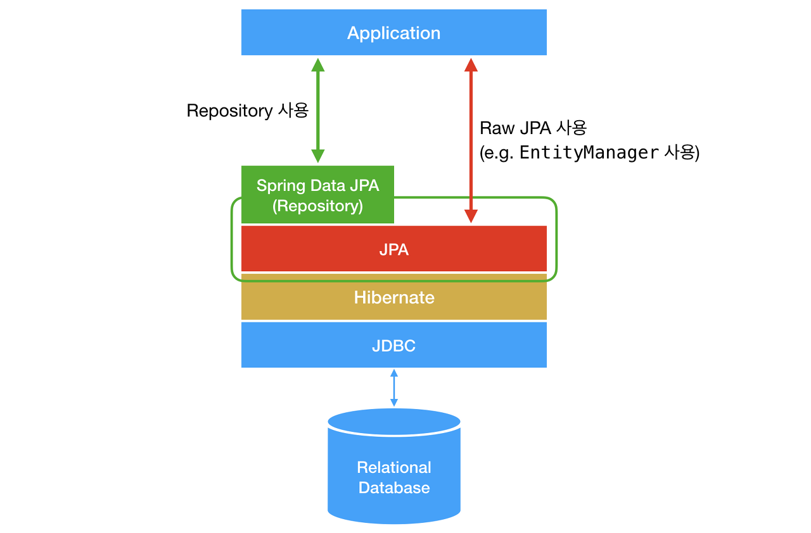

Q. **JPA & Query DSL vs MyBatis**

A. 기본적인 쿼리(CRUD)는 jpa로 짜고, 동적 쿼리는 mybatis 처리를 한다.

# JPA

## JPA란 무엇인가?

- JPA는 `Java Persistence API`의 약자다.
- Java 진영에서 `ORM(Object-Relational Mapping) 기술 표준`으로 사용하는 인터페이스 모음
- 자바 어플리케이션에서 `관계형 데이터 베이스`를 사용하는 방식을 정의한 인터페이스
- 어플리케이션과 JDBC(Java Database Connectivity) 사이에서 동작한다.
- 인터페이스이기 때문에 Hibernate, OpenJPA 등이 JPA를 구현한다.


## ORM 

우리가 일반적으로 알고 있는 애플리케이션 Class와 RDB(Relational DataBase)의 테이블을 매핑(연결)한다는 뜻이며,
기술적으로는 어플리케이션의 `객체를 RDB 테이블에 자동으로 영속화 해주는 것`이라고 보면 된다.

- ORM(Object Relational Mapping)은 `객체-관계-매핑` 의 약자다.
- 객체와 테이블을 매핑해서 `패러다임의 불일치`를 개발자 대신 해결해준다.


> #### 패러다임의 불일치란?
> 데이터베이스는 데이터를 중심으로 구조화 되어있고, 객체의 상속과 다형성 같은 개념이 없다.
> 
> 그러다보니, 객체와 데이터베이스가 지향하는 점이 다르다. 이것을 객체와 데이터베이스의 **패러다임 불일치**라 한다.

> #### 예시 
> JAVA에서는 부모클래스와 자식클래스의 관게, 즉 **상속 관계**가 존재한다.
> Class에서 또 다른 Class Type을 필드 변수로 가지고 있는 **연관관계**라는 것도 있다.
> 데이터베이스에서는 이러한 객체의 상속 관계 및 연관관계를 표현하려면 복잡한 쿼리문이 필요하다.
> 
> **JPA는 상속 관계 및 연관 관계를 자동으로 주입해준다.** 매우 편하게 !!!
> 
> 자세한 사용법은 JPA 문법을 참고하자.


## 왜 JPA를 사용해야 할까?

1. JPA는 반복적인 CRUD SQL을 처리해준다. 매우 편리하다.

2. JPA는 매핑된 관계를 이용해서 SQL을 생성하고 실행하는데,
개발자는 어떤 SQL이 실행될지 생각만하면 되고, 예측도 쉽게 할 수 있다. 

3. 추가적으로 JPA는 네이티브 SQL이란 기능을 제공해주는데
관계 매핑이 어렵거나 성능에 대한 이슈가 우려되는 경우 SQL을 직접 작성하여 사용할 수도 있다.

- 가장 큰 장점은 SQL이 아닌 객체 중심으로 개발할 수 있다는 것
- 앞서 말한 패러다임의 불일치를 해결해 준다는 것

추가적으로 알아둬야 할 것은, 스프링에서 흔히 사용하는 JPA는 JPA을 이용하는 **spring-data-jpa 프레임워크**지, JPA는 아니라는 것이다.


<br>

# JPQL

### ORM의 목적
  - DB 테이블이 아닌, 엔티티 객체를 대상으로 개발하기

### JPQL이란?
  - 위와 같은 ORM의 목적처럼, `엔티티 객체를 대상으로 데이터를 검색하기 위한` 객체지향 쿼리이다.
  - `보다 복잡한 쿼리를 위해` JPA에서 제공하는 기능

### JPQL의 특징
  - 테이블이 아닌 객체를 대상으로 검색하는 `객체지향 쿼리`
  - `SQL을 추상화`해서 특정 DB SQL에 의존하지 않는다.

### SQL vs JPQL
  - **SQL**
    - DB 테이블을 대상으로 하는 데이터 중심의 쿼리
  - **JPQL**
    - 엔티티 객체를 대상으로 하는 객체지향 쿼리
    - JPA가 JPQL을 분석하여 적절한 SQL을 만들어 DB를 조회한다.
  - Criteria나 QueryDSL은 JPQ L을 편하게 작성할 수 있게 도와주는 빌더 클래스일 뿐이다.

### JPA 사용 예시
```java
/** 회원 엔티티 **/
@Entity(name="Member") //엔티티 이름 설정
public class Member{
    @Column(name="name")
    private String username;
    //..
}
```
```java
/** JPQL 쿼리 **/
String jpql ="select m from Member m where m.username='kim'";
List <member> resultList = em.createQuery(jpql, Member.class).getResultList();
```

- 회원 이름이 kim 인 엔티티를 조회한다.
- JPQL에서 Member는 엔티티 이름이다.
- m.username 은 테이블 칼럼명이 아니라, 엔티티 객체의 필드명이다.
- em.createQuery()의 메서드
  - 실행한 JPQL
  - 반환할 엔티티의 클래스 타입인 Member.class
  - 위 두가지를 해당 메서드에 넘겨주고 getResultList() 메서드를 실행하면, JPA는 JPQL을 SQL로 변환해서 DB를 조회한다.

```jpaql
/** 실행한 JPQL **/
select m
from Member m
where m.username='kim'
```
```sql
/** 실제로 실행된 SQL **/
select
    member.id as id,
    member.age as age,
    member.team_id as team,
    member.name as name
from
    Member member
where
    member.name='kim'
```


<br>

[//]: # (- SQL은 관계형 데이터베이스 관리 시스템의 데이터를 관리하기 위해 설계된 특수 목적의 프로그래밍 언어.)

[//]: # (- native SQL은 개발자가 직접 정의하는 SQL을 뜻한다.)

[//]: # (## QueryDsl)

[//]: # ()
[//]: # (JPA를 구현한 대표적인 오픈소스)