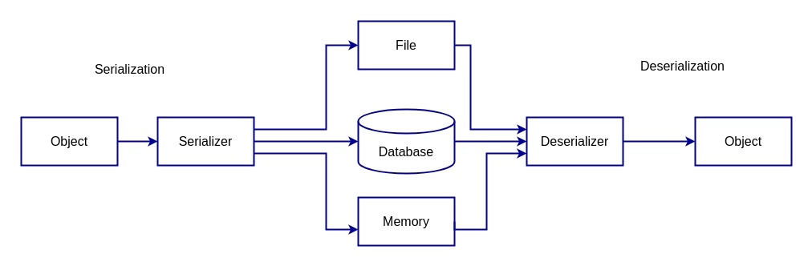

> 직렬화(serialization)와 역직렬화(deserialization)은 개체를 쉽게 저장, 전송 및 재구성하기 위해 존재한다.
> 
> 데이터베이스에 개체 저장, 네트워크를 통해 객체 전송 또는 메모리에 개체 캐싱과 같은 다양한 시나리오에서 사용된다.


## 직렬화와 역직렬화

직렬화(Serialization)는 자바 시스템에서 사용되는 객체 또는 데이터를 외부의 자바 시스템에서도 사용할 수 있도록
 **객체의 상태를 바이트 스트림으로 변환하는 프로세스**  이다.

역직렬화(Deserialization)는 반대로 직렬화를 통해 변환된 **바이트 스트림 데이터를 다시 객체로 변환**하는 것이다.

이러한 직렬화와 역직렬화 기술은 메모리에 위치한 데이터를 디스크에 저장시키거나, 네트워크 통신에 사용하기 위한 목적으로 사용된다.

JSON, XML 및 바이너리와 같은 다양한 포맷을 직렬화에 사용할 수 있다.




<br>


### 직렬화 - 객체 to 바이트 스트림 데이터

- 자바 객체를 직렬화 할 때는 `ObjectOutputStream.write`를 사용한다.

```java
public final void writeObject(Object o) throws IOException;
```

```java
// SerializableClass 타입의 객체를 생성한다.
SerializableClass obj = new Serializable

// 직렬화 된 내용을 Serializaiton.out 파일에 저장한다.        
try(ObjectOutput out = new ObjectOuputStream(new FileOutputStream("Serialization.out"))){
    out.writeObject(obj);
}

```

- 객체를 파일에 저장하기 위해 `java.io.ObjectOutput` 인터페이스를 구현한 `ObjectOutputStream` 객체를 생성한다.

- `ObjectOutputStream`은 `FileOutputStream`을 생성자의 인자로 받아들여, 파일에 데이터를 쓰기 위해 사용된다.

- `out.writeObject(obj)`를 호출하여 주입받은 `OutputStream`에 직렬화된 바이트 스트림 데이터를 write한다.(전송한다)
  - 이 때, `ObjectOutputStream`은 객체를 직렬화하기 위해 `writeObject()` 메서드를 사용했다.
  - `writeObject()` 메서드는 `Object`를 인자로 받아들여 객체를 직렬화 한다.
  - Serialization.out 파일에는 직렬화된 내용이 읽혀 저장된다. 이후 역직렬화 과정을 통해 해당 파일을 읽어올 수 있다.


### 역직렬화 - 바이트 스트림 데이터 to 객체

- 역직렬화 시에는 `ObjectInputStream.readObject`를 사용한다.

```java
public final Object readObject() throws IOException, ClassNotFoundException;
```

```java
//Serialization.out 파일에 직렬화된 내용을 읽어와서 역직렬화 한다.
SerializableClass deserializedObj;
try(ObjectInput in = new ObjectInputStream(new FileInputStream("Serialization.out"))){
    deserializedObj=(SerializableClass) in.readObject();
}
```

- `in.readObject()`를 호출하여 "Serialization.out" 파일에서 직렬화된 객체를 읽어온다.
  - 이 때, `ObjectInputStream`은 객체를 역직렬화하기 위해 `readObject()` 메서드를 사용했다.
- 읽어온 역직렬화된 객체를 `SerializableClass` 타입으로 형변환되어 `deserializedObj` 변수에 할당 되었다.


<br>

## Serializable

자바에서 객체를 직렬화하기 위해선 해당 객체의 타입 클래스가 직렬화가 가능한 클래스이어야 한다.

클래스를 직렬화가 가능하도록 선언하기 위해서는 `java.io.Serializable` 인터페이스를 구현하거나,
`Serializable` 인터페이스를 구현한 클래스를 상속받아야 한다.

위에서 보인 `SerializableClass`는 처음 보는 녀석일 것이다. 이 친구가 바로 `Serializable` 인터페이스를 구현한 것이다.

```java
//Serializable 인터페이스를 implements 하여 직렬화가 가능한 클래스
public class SerializableClass implements Serializable {
    public void method(){
        ...
    }
}
//Serializable 인터페이스를 구현한 클래스를 상속받아 직렬화가 가능한 클래스
public class SerializableClass extends SerializableClass2 {
    ...
}
```


----
출처
- https://www.baeldung.com/cs/serialization-deserialization
- 